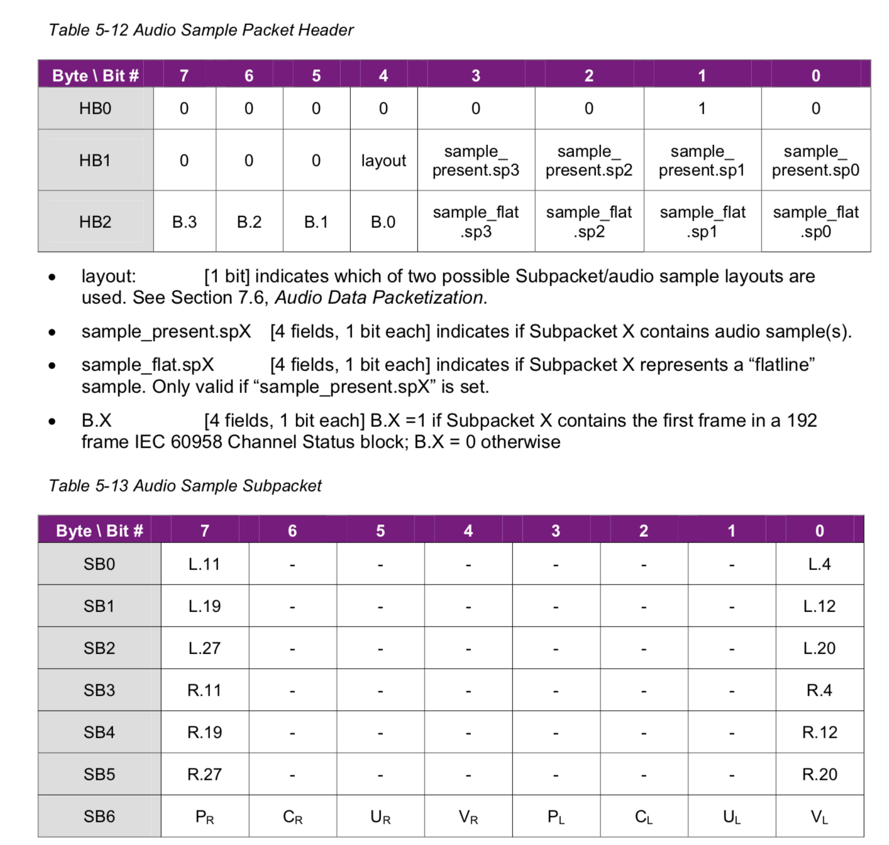
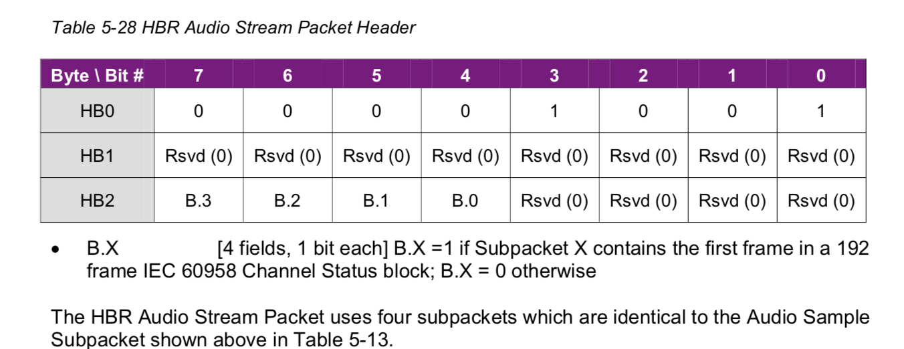
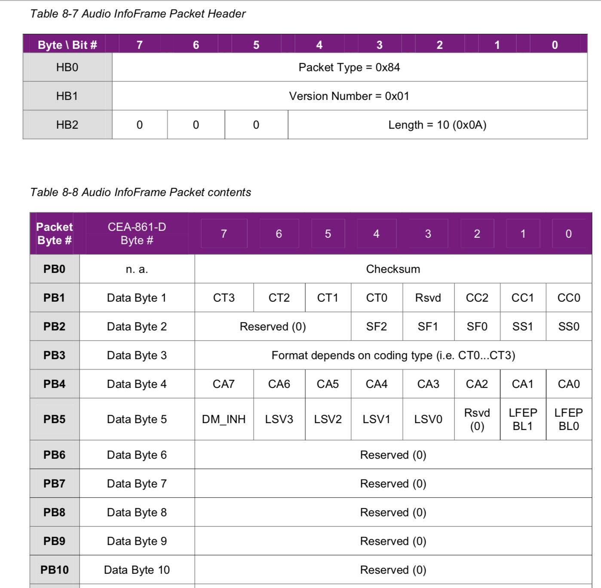

#HDMI 1.4 spec & CEA861-D

L-PCM and IEC61937 compressed audio data is formatted in the **Audio Sample Packet** or in the **High Bitrate Audio Stream Packet** as a structure that closely resembles in an IEC60958 frame.

**Audio Clock Regeneration**: 128*fs = f_tdms * N/CTS

For any L-PCM stream, the ACR fs value shall be equal to the audio sample rate.

For any IEC60958 compressed audio with an IEC60958 frame rate at or below 192kHZ, the fs value shall be equal to the frame rate. For any such stream with an IEC60958 frame rate above 192kHZ, the ACR fs value shall be 1/4th of the frame rate.

人耳的反应范围在20HZ-20KHZ，根据奈奎斯特采样定律，fs>40KHZ就能不失真的还原信号。CD碟片的音频采样fs=44.1KHZ，属于高保真的数字音频。

basic audio：2 channel 32k，44.1k，48k

source可选支持2 channel 32k，44.1k，48k其中一种或几种

sink必须支持2 channel 32k，44.1k

有时候，为了获得足够的带宽来传输audio，可以选择pixel repetition。 pixel repetition就是Htotal增加一倍，因此会有足够的Data Island Period来传输audio，Htotal增加一倍的后果也有pixel clock会增加一倍。

2 channel PCM can never exceed 192kHZ.

**Audio,Video synchronization:** An HDMI source shall be capable of transmitting audio and video streams no more than +_ 20msec of audio delay ralative to the video.

1个audio sample packet包含4个2 channel L-PCM的采样

1个audio sample packet包含1个8 channel L-PCM的采样

**audio sample packet**：

1. layout 0 for 2 channel L-PCM或IEC61937 compressed audio（fs<=192kHZ, 大于192kHZ的用High-Bitrate audio stream packet）
2. layout 1 for L-PCM multi-channel

**High-Bitrate audio stream packet**：when carrying IEC61937 compressed audio at frame rate above 192kHZ, the High-Bitrate audio stream packet shall be used. For many high bitrate streams (e.g. DTS-HD Master Audio and Dolby MAT), the IEC61937 data burst will have a repetition period that is multiple of four frames因为一个packet能包含4个frame, and so the Pa and Pb syncwords will always be found in the same subpacket. In such cases, the codec vendor may impose the additional constraint that Pa and Pb always appear in subpacket 0. Each packet carries four contiguous IEC60958 frames which corresponds to (4 * 2 * 16=) 128 bits of an IEC61937 stream.

**Audio Return Channel**:  The audio return channel features allows an HDMI Sink to transimit an IEC60958 audio stream in the reverse direction to the TMDS path to an HDMI source or an HDMI repeater. The Utility line alone (single mode) or the Utility line in conjunction  with the Hot  Plug Detect line (common mode) may be used for ARC transmission.

**Audio InfoFrame**: 

1. Audio Infoframe 至少每帧发送一次

2. Audio InfoFrame shall be transmitted no later than one video field following the first affected non-silent audio sample. 正常来讲，Audio Infoframe在audio packet发送之前就发送。

3. * **Channel Count **（可填0 refer to stream header，也可以填channel count实际值）

   * Coding Type（0，refer to stream header ）

   * Sample Size （0，refer to stream header ）

   * Sample Frequency（0，refer to stream header ）

   * **Channel  Speaker Allocation **(只对multi-channel L-PCM有效，因为它的data中不包含这部分信息，只能从audio infoframe中拿，而对于其他例如IEC61937 audio stream，它的data中会包含这部分信息，不用从audio infoframe中获取)

     > speaker placement :
     >
     >  Front 
     >
     > ​			FL - FLC - FC - FRC - FR
     >
     > ​													LFE
     >
     > ​			RL - RLC - RC - RRC -RR
     >
     > Rear
     >
     > ***FL*** : front left
     >
     > ***FLC*** : front left center
     >
     > ***LFE***: low frequency effect

   * LSV0…LSV3 (Level shift value, for downmixing)

   * DM_INH (Donwmix Inhibit,只针对DVD audio应用下才设置为1)

   * LFEPBL0，LFEPBL1
   
4. 861-D中规定，当audio infoframe中的内容和实际audio stream中内容冲突时，以实际audio stream内容为准

# I2S 

I2S（Inter-IC sound）

协议规定：MCLK / LRCK = 256 or 384, BCK / LRCK = 64 or 128 or 256

对于HDMI来说，audio bit depth最高到24bit，所以采用BCK / LRCK = 64，即左右声道各32 bit。

# IEC60958

通过一根线同时传递时钟信号和数据信号

Biphase Mark Code 双相符号编码

1 block = 192 frame ；1 frame = 2 subframe

**subframe结构：**

| Preamble        | Auxiliary      |            | LSB              MSB | U    | V    | C    | P    |
| --------------- | -------------- | ---------- | -------------------- | ---- | ---- | ---- | ---- |
| 0             3 | 4            7 | 8       11 | 12                27 | 29   | 29   | 30   | 31   |

U user bit, V validity bit, C channel status bit, P parity bit

**Channel Status Bit：**

| Bit Number（LSB-MSB）                                        | Value（LSB-MSB）                                             |
| ------------------------------------------------------------ | ------------------------------------------------------------ |
| Bit 0                                                        | 0（fixed, for consumer use）                                 |
| **Bit 1 (audio format information)**                         | 0 for L-PCM, 1 for others                                    |
| Bit 2 (copyright assertion)                                  |                                                              |
| Bit 3-5 （additional format information， meaning depends on bit 1） |                                                              |
| Bit 6-7 (mode)                                               | 00 (fixed, mode 0)                                           |
| Bit 8-15 (category code)                                     | lsb at bit 8                                                 |
| Bit 16-19 (source number)                                    | (0000, do not take into account), lsb at bit 16              |
| Bit 20-23 (channel number)                                   | (0000, do not take into ccount), lsb at bit 20               |
| **Bit 24-27 (sampling frequency)**                           |                                                              |
| **Bit 28-29 (clock accuracy)**                               |                                                              |
| Bit 30-31                                                    | 00 (fixed)                                                   |
| **Bit 32-35 (sample word length)**                           | bit depth可选16-24                                           |
| Bit 36-39 (original sampling frequency)                      |                                                              |
| Bit 40-41 (CGMS-A)                                           | 00 coping is permitted without restrictions ; 01 condition not be used; 10 one generation of copies may be made; 11 no coping is permitted |

channel status bit共192bit，但实际只有bit 0-41有包含有效内容，bit 42-191均reserved

# IEC61937

| ...  | Data-burst | Stuffing | Data-burst | Stuffing | Data-burst | ...  |
| ---- | ---------- | -------- | ---------- | -------- | ---------- | ---- |
|      |            |          |            |          |            |      |

**Data-burst**的构成：

| Pa        | Pb        | Pc         | Pd                                                           | Burst-payload |
| --------- | --------- | ---------- | ------------------------------------------------------------ | ------------- |
| **F872**h | **4E1F**h | burst-info | length of burst-payload, bits or bytes according to audio format |               |

Pa，Pb，Pc，Pd均为16bit数据，构成**Burst Preamble**，分别被封装在IEC60958的一个subframe中。Pa，Pb是sync word，值是固定的。Pc是burst-info，Pd表明burst-payload长度。

**burst-info:**

| Bits of Pc | Description                                                  |
| ---------- | ------------------------------------------------------------ |
| 0-6        | **Data-type**                                                |
| 7          | **Error flag**, indicate the burst-payload is valid or invalid |
| 8-12       | **Data-type-dependent info**                                 |
| 13-15      | **Bitstream-number**                                         |

Receiver是否检查Error flag是可选的。

**Data-burst**可分为3类，audio Data-burst，pause Data-burst，null Data-burst。pause Data-burst可以用于gap audio Data-burst，or switch audio data type，即在两个audio Data-burst之间，类似于下表示意：

| ...  | Stuffing | Audio Data-burst | Stuffing | Pause Data-burst | Stuffing | Audio     Data-burst | Stuffing | ...  |
| ---- | -------- | ---------------- | -------- | ---------------- | -------- | -------------------- | -------- | ---- |
|      |          |                  |          |                  |          |                      |          |      |

stuffing，也可以称为**burst spacing**，是由4个16bit全0构成，没有Pa,Pb,Pc,Pd。Burst preamble是只有Data-burst才有，stuffing没有Burst Preamble（Pa,Pb,Pc,Pd）

# HDMI audio

实际方案中，HDMI 目前仅支持L-PCM和None Linear PCM（即仅支持通过Audio sample packet和High Bitrate Audio Stream Packet传送audio data），不支持one bit audio和DST audio。

* L-PCM：from hardware perspective, audio module送L-PCM audio data到HDMI module，只会通过I2S（有4根Data line，最高支持同时送8ch的数据）
* None-Linear PCM: 只会通过SPDIF传送数据，在>192kHZ(High Bitrate audio Stream Packet)的时候，此SPDIF有一对应的High Bitrate模式。

