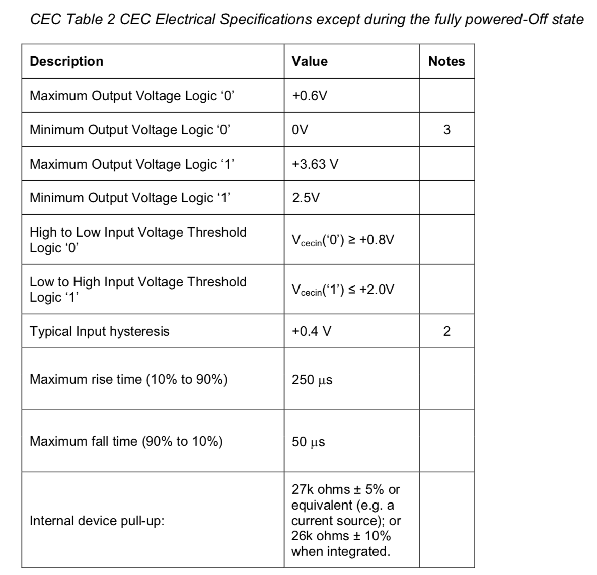
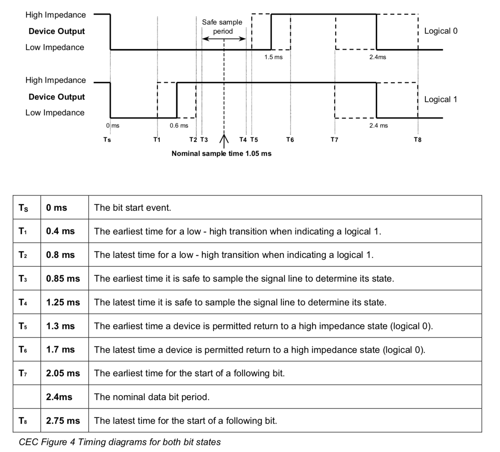
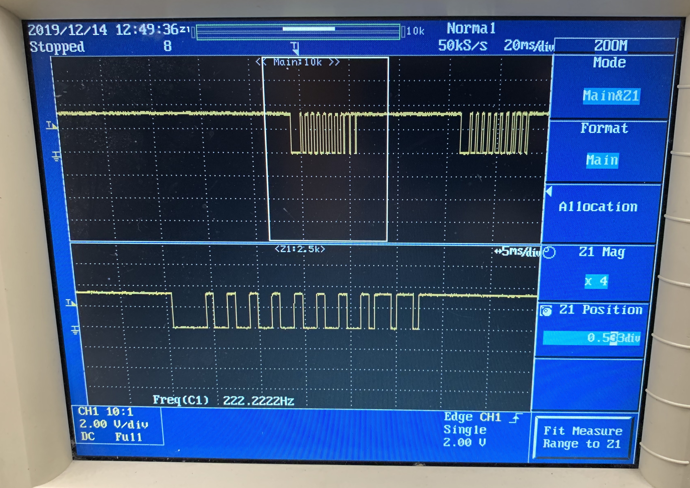
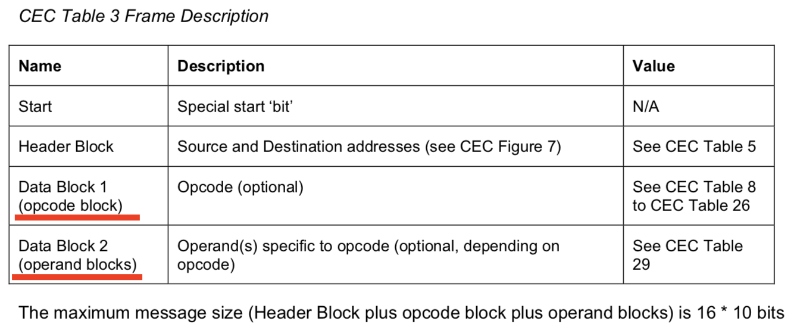

#Electrical Specification

1. During the powered-Off state (e.g. power removed), the CEC line is not monitored. 

   > 当device处于power off状态（完全断电情况下），cec line可以不监控。漏电流最大1.8微安。

   

2. in all other power states. In these states, the device shall keep monitoring the CEC line for any messages addressing that device, including any messages that bring the device out of Standby 

   > 当device处于power off以外的其它状态时，应该满足下面电气特性要求：

#Signaling and Bit Timings

##Start Bit Timing

重要时间参数：**3.7，4.5**，在看波形时方便定位start bit

## Data Bit Timing

重要时间参数：**2.4**，在看波形时方便定位data bit

## ACK Bit Timing

CEC Figure 5 shows an example bit with both Initiator and Follower where the Follower may assert the bit to a logical 0 to acknowledge a Data Block. The Initiator outputs a logical 1, thus allowing the Follower to change the CEC state **by pulling the control line low for the duration of the safe sample period.**

> Initiator继续发1，而Follower在Safe Sample Period拉低。

1. 非广播消息，0 = ACK 拉低表示ACK
2. 广播消息，1 = ACK，拉低表示NACK

看cec波形有以下几个点：

1. 数下降沿，加上start bit，一个block共有11个下降沿（1start bit +10data bit),如果一个cec message有多个block，也只有1个start bit，表明cec message开始。
2. start bit 3.7, 4.5ms; data bit 2.4ms

# Frame Description

##Frame Description

最大message size是16*10 bit。包括Header block和Data block。

# Reliable Communication Mechanism

为了提高CEC可靠性、稳定性，有以下几种机制：

1. **Frame-Retransmission**，重传机制

   * 当directly addressed message被NACK 或者 广播消息被NACK
   * 当Initiator在拉低但是Follower却把CEC line拉高的时候（即initiator cec message被打断）

   在上述两种情况，都应该重传。重传至少1次，但最高不应该超过5次。如果是polling message，建议只重传1次。

2. **Frame Validation**，检查Frame message长度是否符合要求

   如果Data block长度小于对应message的长度，Follower应该忽略这个message

3. **CEC line error handling**，应该检查Data bit timing是否符合规定

# CEC Arbitration

1. **Signal Free Time**，在开始传送一个新的frame之前，应该留有一段空闲时间。

   

   Note: 这里的计量单位是nominal data bit period,即2.4ms；上一个Initiator发完之后要等7个data bit period，而新的Initiator只需要等5个data bit period，这使得CEC bus不会被一个设备独占，让其它设备也有机会成为Initiator。

2. **Message Time Constraints**

   * 理想最大响应时间是200ms
   * 要求最大响应时间是1s

有以下两种方式让Sink（TV）显示OSD字符（具体显示方式由Sink自己决定）

1. CEC message（Set OSD String）

2. SPD InfoFrame 

   Source Product Descriptor InfoFrame：这个InfoFrame可以用来传递Source的一些信息，包含Vendor Name和Product description
   
   > 比较两种方式，其中Set OSD String更自由，可以发送任意字符串，而SPD infoFrame规定用来传输product description信息。