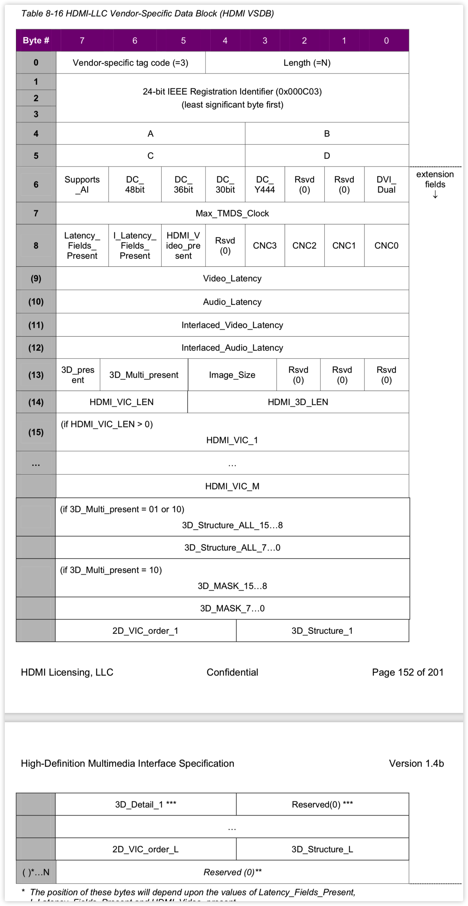

# EDID Block 0：

符合EDID 1.3

1. EDID header
2. Vendor / Product Identification（包含生产厂家，产品序列号，生产年份，周数等）
3. EDID Version
4. Basic Display Parameters and features（显示最大宽度，最大高度等参数）
5. Color Characteristics
6. Establish Timings
7. Standard Timing ID
8. Detailed Timing Descriptor Block（4*18byte，包含pixel clock，Hactive，Vactive，等具体timing参数）
9. Monitor Descriptor Block（2*18byte，Monitor Name和Monitor Range limits，其中Monitor Name中有13byte用于存储ASCI字符表示名字，Monitor Range limits中有Min & Max Vertical Rate， Min & Max Horizontal Rate等参数）
10. Extension Flag和Checksum （Extension Flag用于表示接下来有多少个CEA Extension Block）

# EDID Block 1：

符合CEA Extension Version 3

| Byte       | Value | Description                                                  |
| ---------- | ----- | ------------------------------------------------------------ |
| 0          | 02h   | Tag                                                          |
| 1          | 03h   | Reversion Number                                             |
| 2          | d     | Start of Detailed Timing Description Block                   |
| 3          |       | bit 7(underscan);bit 6(basic audio); bit 5(YCbCr444);bit 4(YCbCr422);lower 4bits(n, the number of Detailed Timing Descriptor Blcok) |
| 4          |       | Start of data block collection                               |
| d-1        |       | End of data block collection                                 |
| d          |       | Start of Detailed Timing Descriptor                          |
| d+(18*n)-1 |       | End of Detailed Timing Descriptor                            |
| d+(18*n)   | 00h   | Beginning of Padding                                         |
| 126        | 00h   | End of Padding                                               |
| 127        |       | Checksum                                                     |

Data Block Header Type

| bit (7 6 5) | Bit (4 3 2 1 0)                                   |
| ----------- | ------------------------------------------------- |
| Tag Code    | length of following data block payload (in bytes) |

Tag Code:

* 0 Reserved

* 1 Audio Data Block

* 2 Video Data Block

* 3 Vendor Specific Data Block

* 4 Speaker Allocation Data Block

* 5 VESA DTC Data Block

* 6 Reserved

* 7 Use Extended Tag 

  > **Video Capability Data Block**
  >
  > > Quantization Range(full range 0-255, limited range 16-235) and Overscan Underscan capability
  >
  > **Vendor Specific Video Data Block**(such as Dolby VSVDB)
  >
  > **Colorimetry Data Block**
  >
  > > ITU601,ITU709,BT2020等信息
  >
  > **Vendor Specific Audio Data Block**

一般来讲，edid block 1中Data Block的排列顺序是Video Data Block，Audio Data Block，Speaker Allocation Data Block，Vendor Specific Data Block，Extended Data Block

##HDMI VSDB

