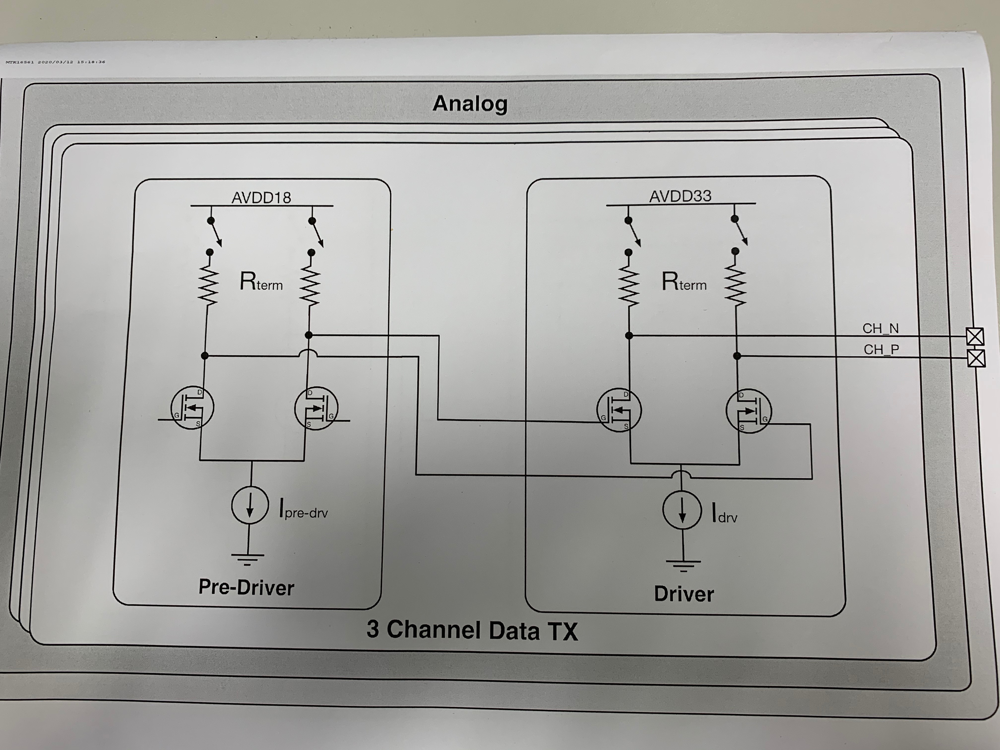

# TMDS

1. **TMDS differential pair示意图**

高电平由AVcc决定，低电平由source端的current source和sink端的AVcc和阻抗RT决定。

* calibrate原理

* Data Channel简图

* Clock Channel简图

  

2. **单端信号**

​	最高 Avcc，最低 AVcc - Vswing

3. **差分信号**

   

4. **TMDS System Operating Conditions**

   

5. **HDMI Source TMDS Characteristics —source电气特性**

   

   * source端直流电气特性：

     

   * source端交流电气特性：

     

   * source端眼图标准：

     

6. **HDMI Sink TMDS Characteristics —sink电气特性**

   * **HDMI Sink Test Points**

     

   * **Sink 电气特性**

     

   * **sink眼图**

     

# +5V signal

# DDC

#Hot Plug Detect Signal (HPD)

