## Topology of HDCP system

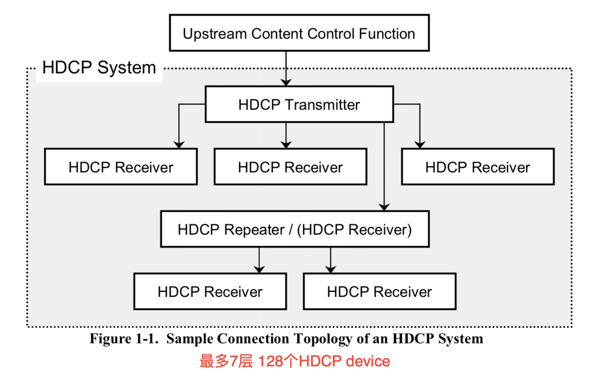

##Protocol

* **First Part of Authentication Protocol**

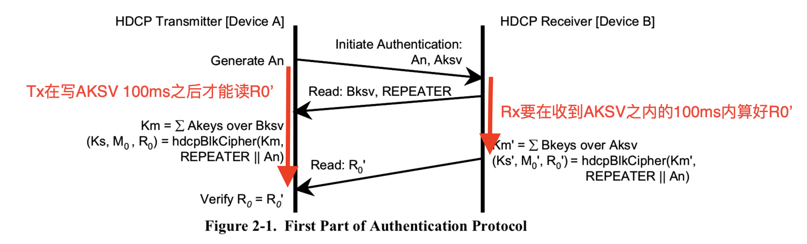

The HDCP Transmitter enables HDCP Encryption when the first part of the authentication protocol successfully completes. 

spec规定在第一阶段认证成功后就可以开始加密，但是在实际方案中，是在第二阶段repeater认证成功之后才开始加密。

* **Second Part of Authentication Protocol**

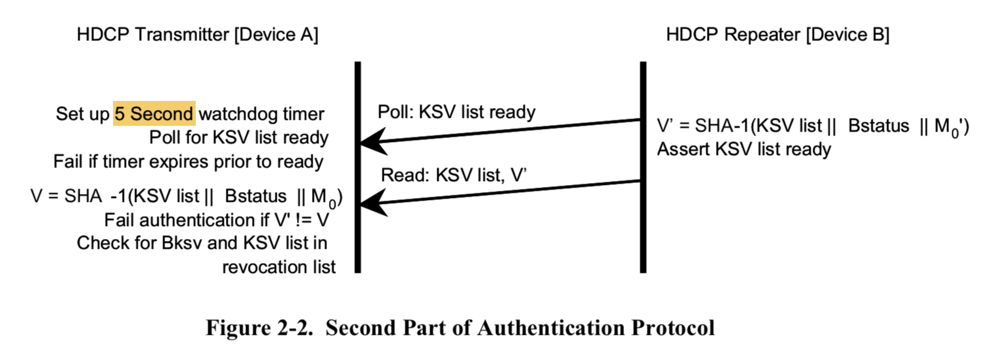

KSV list是指当前repeater下游所有设备的KSV集合，但不包含repeater本身的KSV。

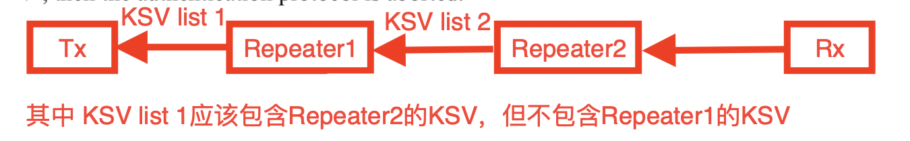

如果KSV list ready bit超时fail，Tx要重新发AKSV和An，重做HDCP;

If either MAX_CASCADE_EXCEEDED or MAX_DEVS_EXCEEDED status bits are set, the READY bit may be set by the repeater, or it may not set the READY bit and simply let the timeout occur in the HDCP transmitter.

当Repeater下游设备深度或者设备个数超过允许值，repeater可能不会置起ready bit,然后造成超时fail。

* **Third Part of Authentication Protocol**

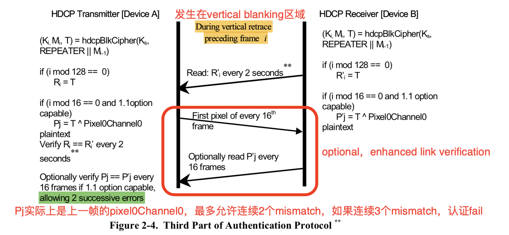

1. 可以每2s或者每128帧比对一次Ri

2. The HDCP Transmitter verifies *Ri*' against its own calculations to insure that the video receiver is still able to correctly decrypt the information. 匹配Ri是为了保证Tx Rx加密解密同步，保证Rx能正确解密数据。
3. 比较Pj称为 Enhanced Link Verification。如果连续3个Pj失配，则认为连接完整性检查失败，认证失败

4. Frame Counter应该从认证成功之后开始加密的第一帧开始算起（用于每128帧或每16帧）

5. Tx Rx如果都支持enhanced link verification，Tx应该要在写AKSV An之前就写Ainfo中的ENABLE_1.1_FEATURES bit。

##HDCP Port

从I2C角度来讲，Rx只充当slave，Tx是master。读写都由Tx发起

* **第一个HDCP port寄存器表**

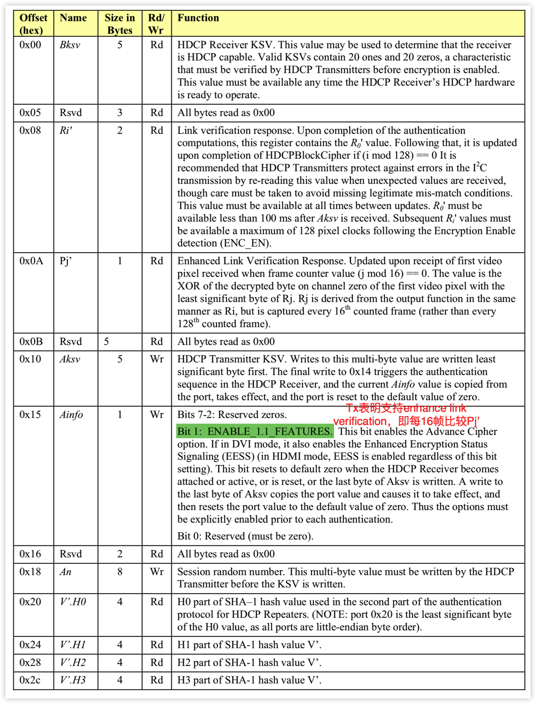

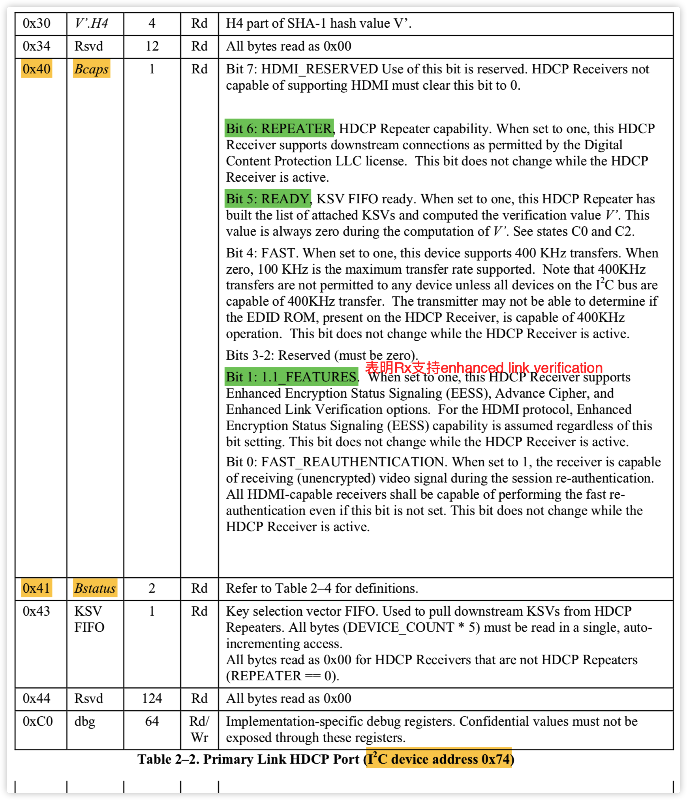

* **第二个HDCP port寄存器表**

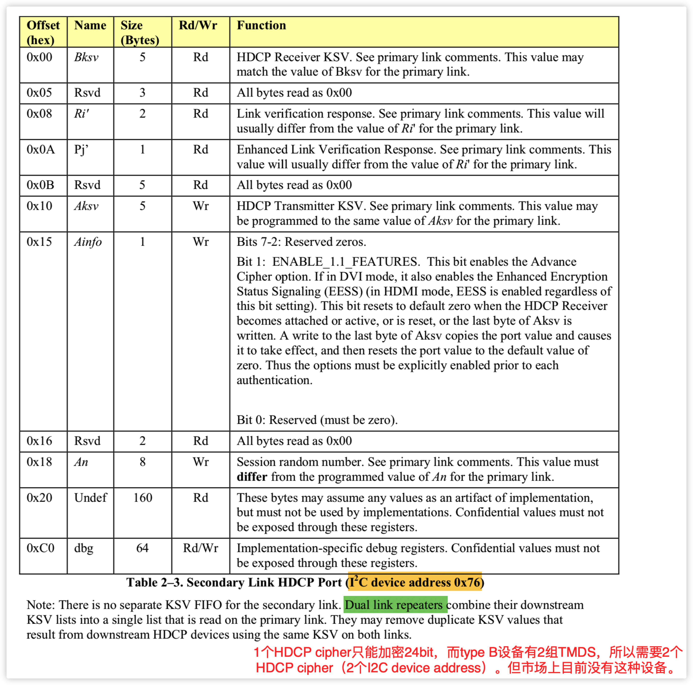

* **Bstatus寄存器**

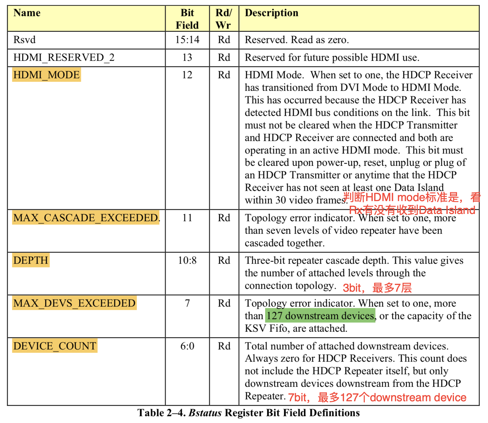

## EESS

**Enhanced Encryption Status Signaling**

*Original Encryption Status Signaling* (OESS) utilizes only CTL3, and is only used during DVI protocol. OESS只能用于DVI协议。

EESS is always used with the HDMI protocol. HDMI总是使用EESS。

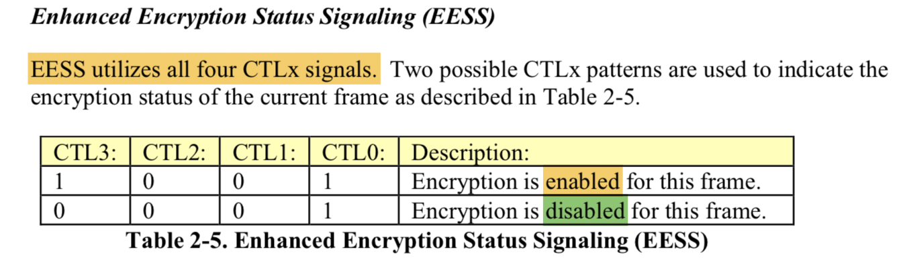

The CTLx signals described in Table 2-5 are only valid within a 16-clock window of opportunity starting at 512 pixel clocks following the active edge of VSYNC. **EESS要在Vsync active edge之后的512 pixel clock—> 528(512+16) pixel clock区间内发送完成。**

It is required that no Data Island or Video Data, nor any Guard Band, be transmitted during a keep-out period that starts 508 pixels past the active edge of VSYNC and ends 650 pixels past the active edge of VSYNC. **keep-out区间内不许发送Video Data，Data Island和Guard Band。**

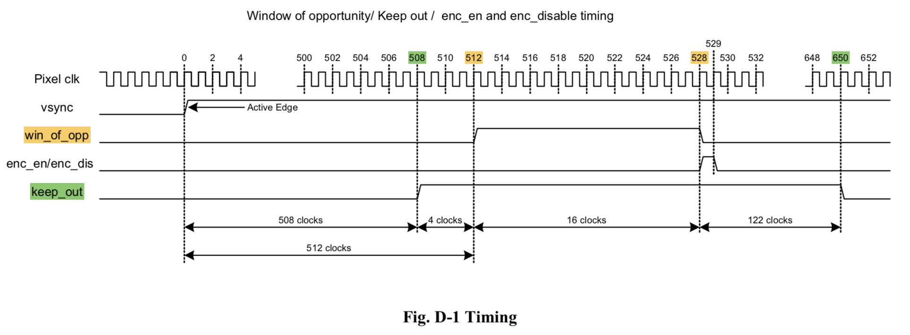

从图上可以看出，keep-out区间在508-650 pixel clock，在这期间不许发Video Data， Data Island和Guard Band。win_of_opp在512-528，win_of_opp之后的数据就是可以ENC_EN加密的，但是529-650这段区间还属于keep-out区间，不允许发Data Island和Video Data。所有只可能有preamble，而preamble又是不加密的，所以实际在keep-out整个区间（508-650）是不加密的。

HDMI transmits data during Video Data Periods and Data Island Periods. All of this data requires HDCP Encryption. **Data Island和Video Data Period需要加密，control period不需要加密**

***Video Data Periods*** are identical to DVI video data periods with the exception that they begin with a two-pixel Leading Guard Band. ***The state transition variable videoData is defined to go TRUE on the first active pixel of video data in the period (i.e. after the Guard Band) and is defined to go FALSE following the last active pixel of video data in the period***. There is no Trailing Guard Band on a Video Data Period. **从第一个active pixel开始加密，Guard Band不做加密！**

***Data Islands*** begin with a two-pixel Leading Guard Band and end with a two-pixel Trailing Guard Band. Between the Guard Bands, packet data is transmitted. Unlike the 8 to 10 bit encoding used for video pixel data, each pixel of the packet data is encoded using T.M.D.S. Error Reduction Coding (TERC4) performing a 4 to 10 bit conversion of the input packet data to the 10 bits required for differential transmission on each of the three T.M.D.S. channels. The state transition variable *packetData* is defined to go TRUE for the first pixel of the Data Island containing packet data (***i.e. first pixel following the Leading Guard Band***) and is defined to go FALSE following the last pixel containing packet data (i.e. the first pixel of the Trailing Guard Band). **Guard Band不做加密！**

The HDMI Specification defines a facility for the HDCP Transmitter to inform the HDCP Receiver that the streams being transmitted contain no useful visual or aural information and should be muted. ***HDCP uses this mechanism to provide a means of temporarily disabling HDCP Encryption while remaining authenticated. During the AVMUTE state, an HDCP Transmitter is required to not assert any ENC_EN signal. Also during the AVMUTE state, the HDCP Receiver should ignore Encryption Status Signaling and operate as if ENC_DIS is asserted.***  

1. AVMUTE，保持HDCP握手成功的状态，但是不对数据做加密

2. 在AVMUTE的时候，Tx不应该发ENC_EN，Rx要主动认为ENC_DIS

3. AVMTUE GCP只能在Vsync active edge之后的0—>384 pixel clock之内发送，EESS只能在512—>528 pixel clock之内发送。即AVMUTE是先于EESS发送的，**在AVMUTE的情况下，Tx应该将EESS从ENC_EN切换到ENC_DIS的状态**

##Data Encryption

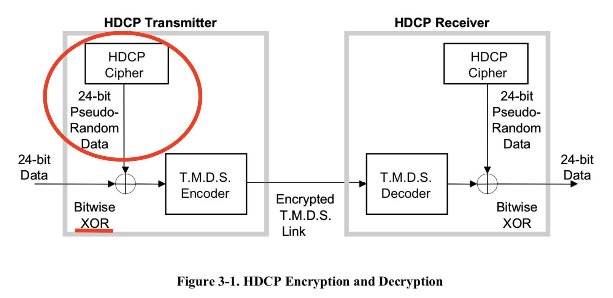

In dual-link implementations the Audiovisual Content is 48-bits wide and requires two HDCP Ciphers to produce the required pseudo-random streams. **1个HDCP cipher只能加密24bit，Type B需要2个HDCP cipher。**

## HDCP Cipher

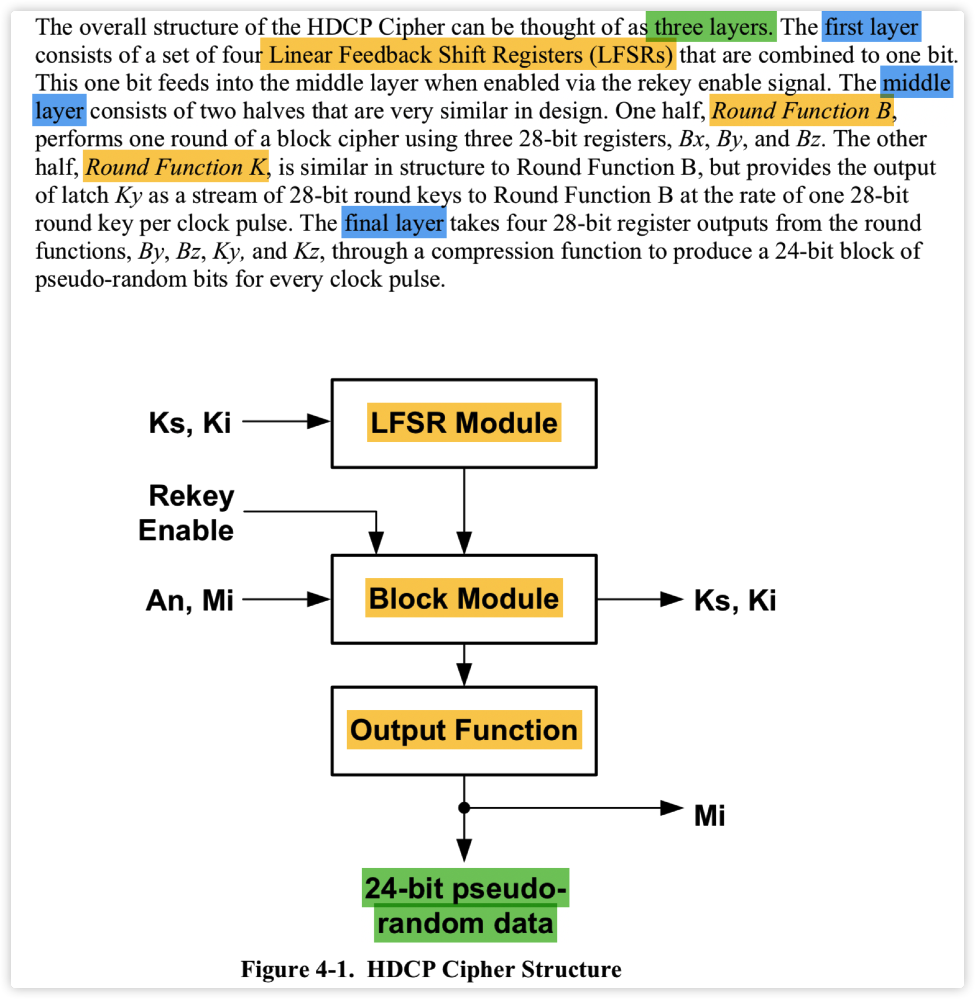

HDCP 1.4 Cipher Block共分3层，每个clock pulse生成24bit伪随机数用于内容加密（加密1个24bit pixel）。而HDCP 2.2 Cipher Block每个clock pulse会生成128bit伪随机数（加密5个24bit pixel，剩余8bit不用）