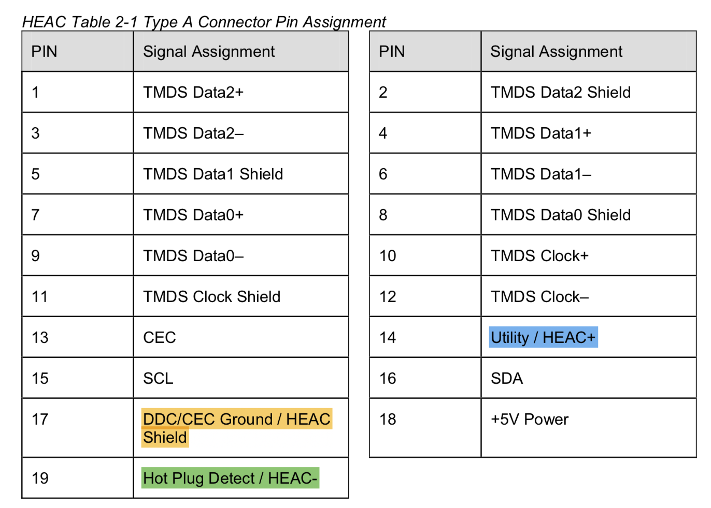
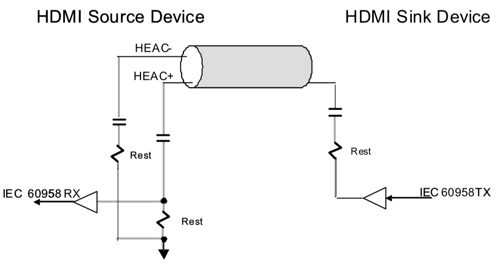
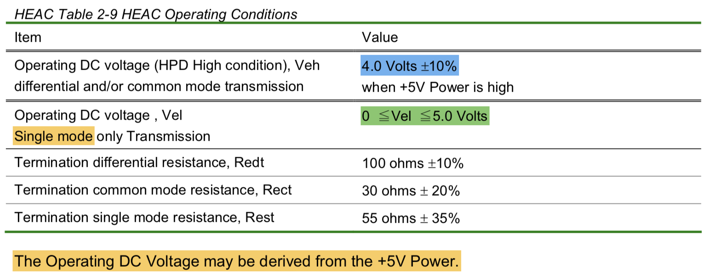
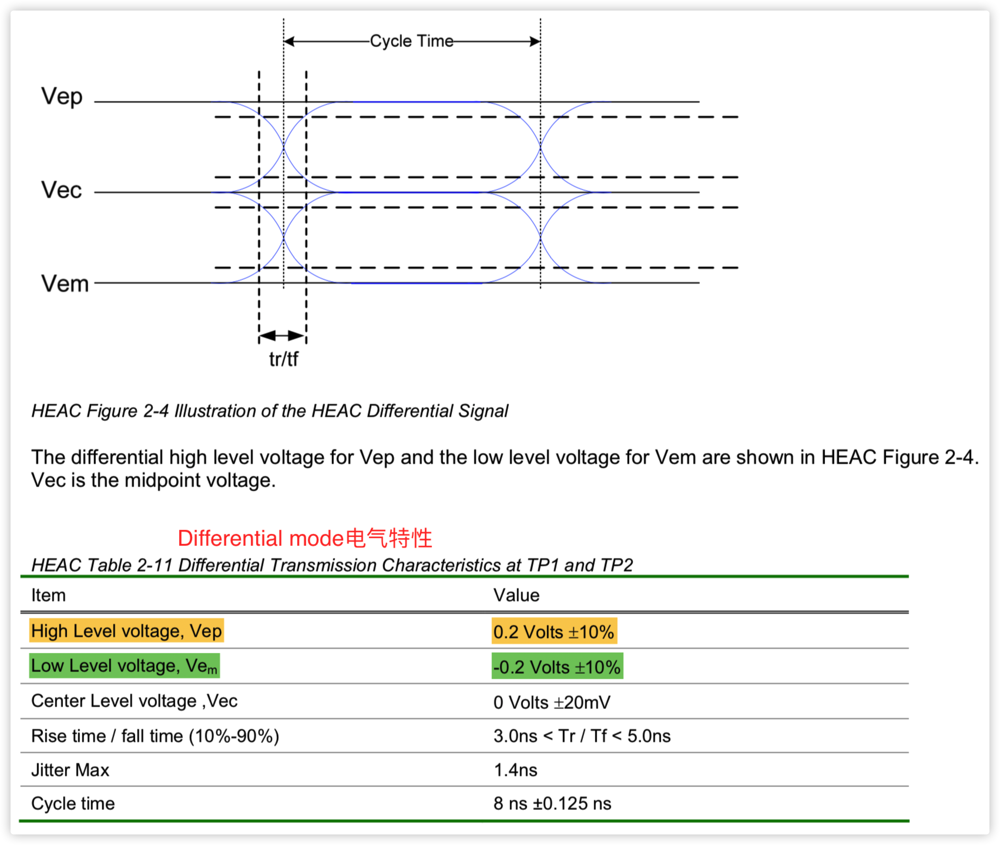
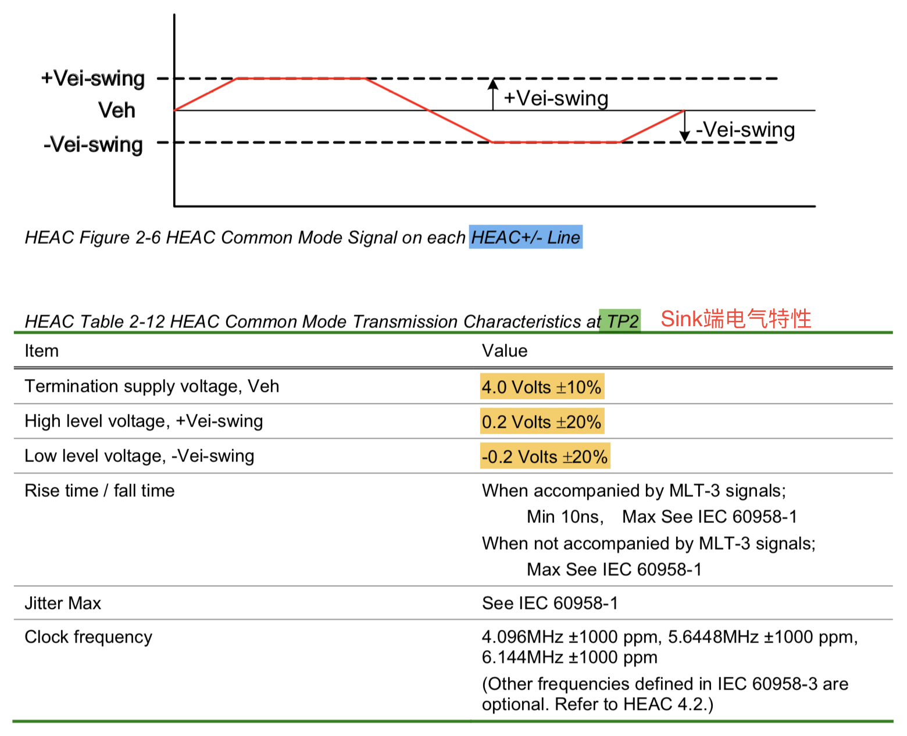
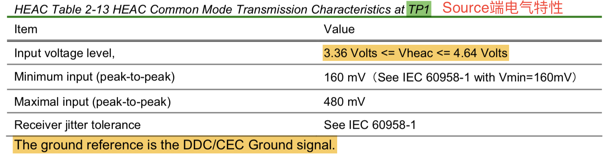
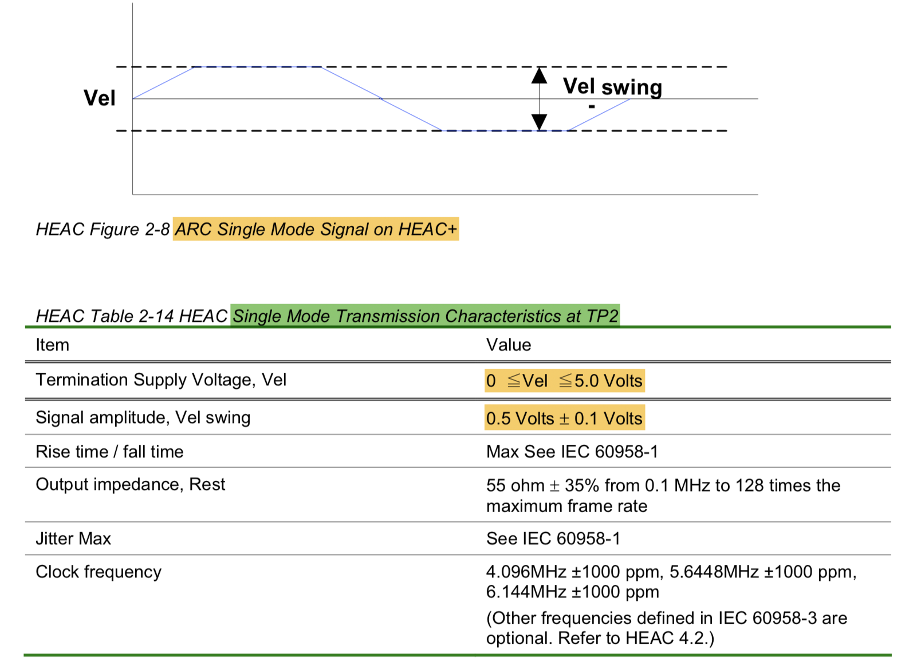
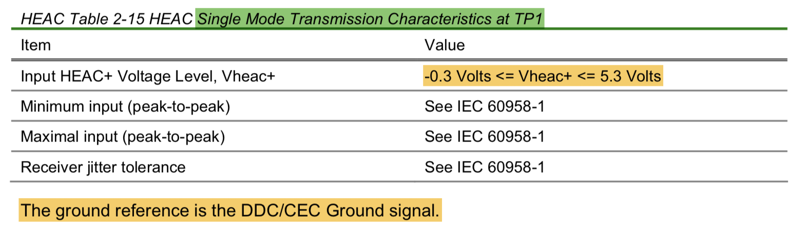
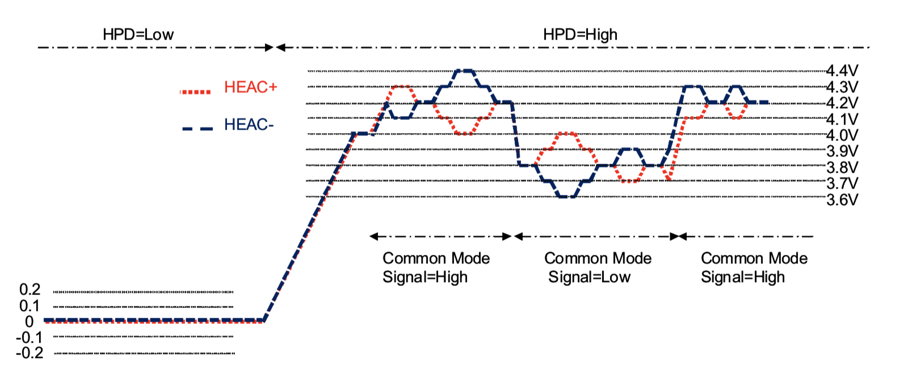

**HEAC (HDMI Ethernet and Audio Return Channel) **包含两个功能：

1. HEC , HDMI Ethernet Channel
2. ARC , Audio Return Channel

##Type A Connector Pin Assignment

**HEC only, 在differential mode **

**ARC only,可以是single mode或common mode**

**如果同时ARC和HEC，必须同时是common mode和differential mode**

##ARC 简图

如果支持ARC，ARC Rx必须同时支持single mode和common mode；而ARC Tx可以只支持single mode

## System Operating Conditions

## Differential Signal Characteristics

**differential mode电气特性**

##Common Mode Signal Characteristics

**Common mode电气特性**

##Single Mode Signal Characteristics

**single mode电气特性**

* single mode只用HEAC+一根线即可

* single mode只能用来传ARC信号（即IEC60958信号），不能和differential mode一同传送

  

## Receiver Performance

同时传递HEC和ARC信号（即同时工作在differential mode和common mode），信号波形可能如下：

在这个波形图上，其实有多个信号，一个高频信号（HEC），一个低频信号（ARC）。**两个信号相加减，就可以还原两个原始信号。**

