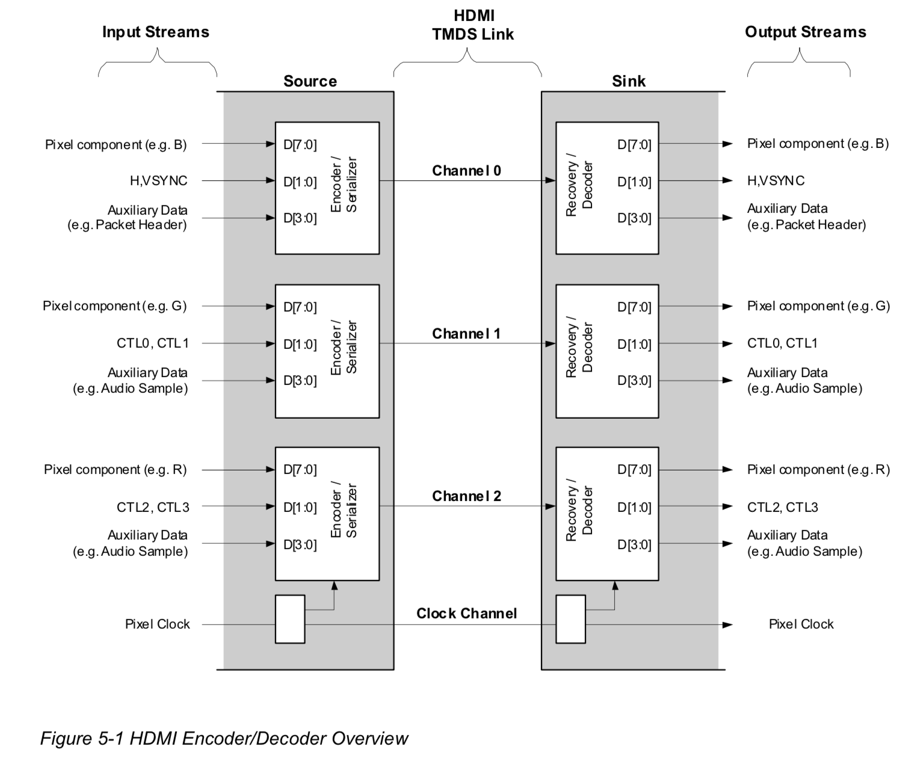
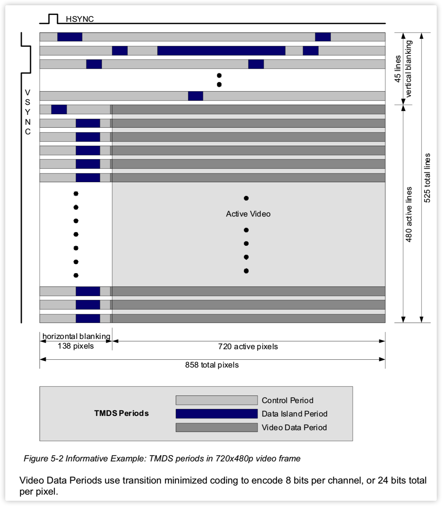
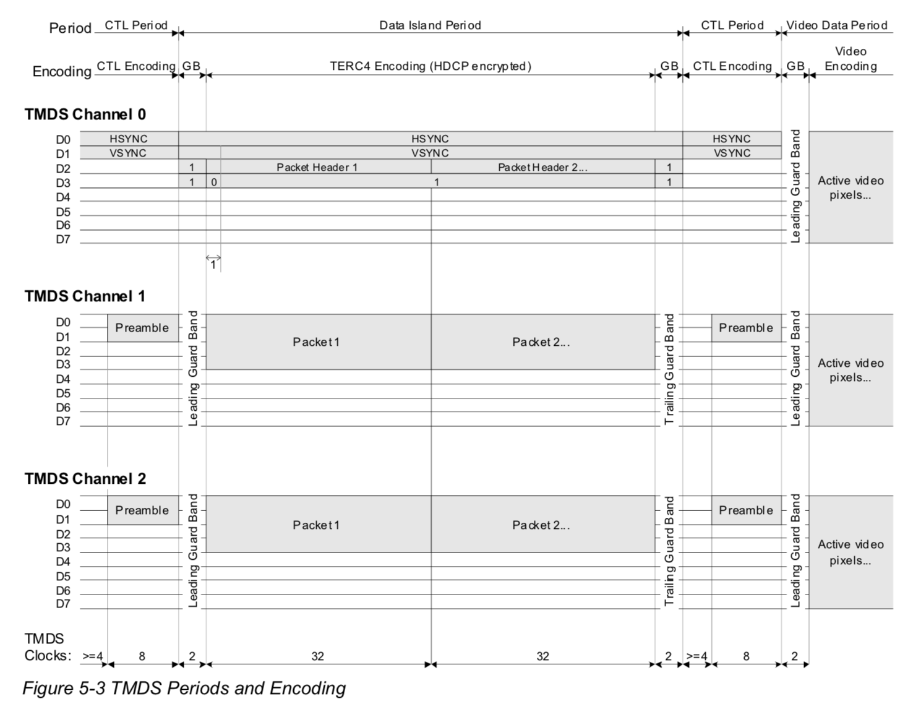
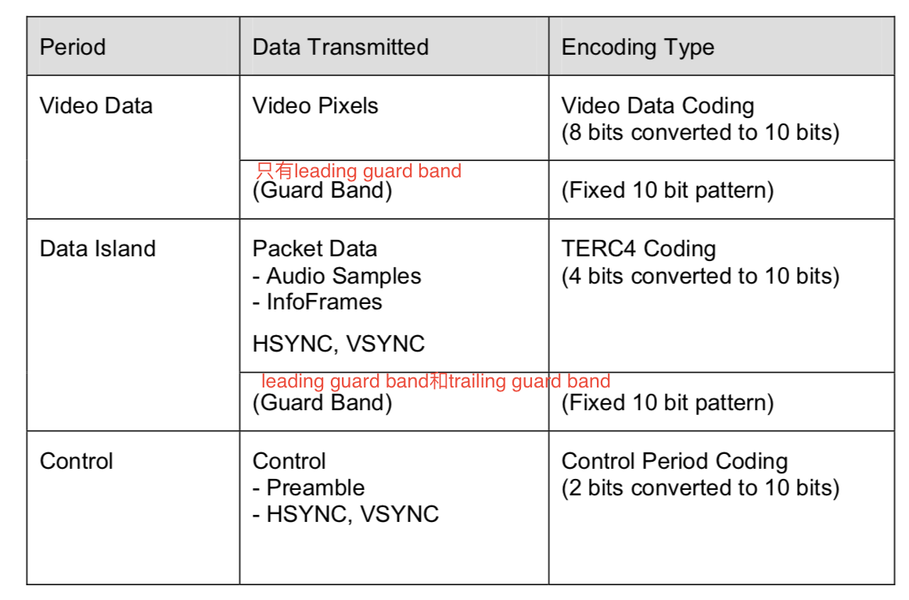
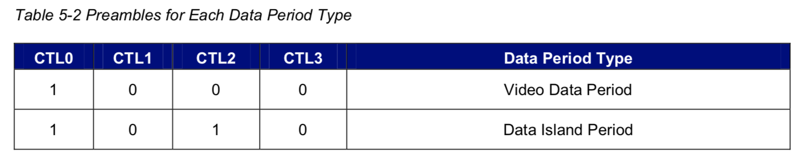
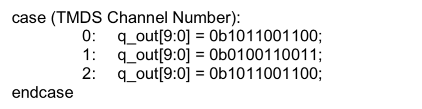
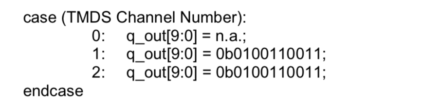
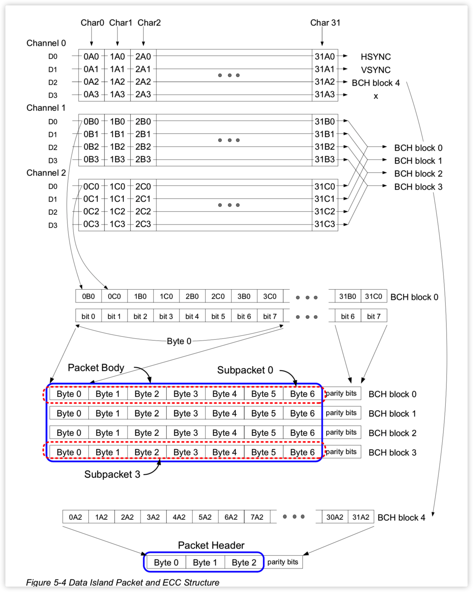
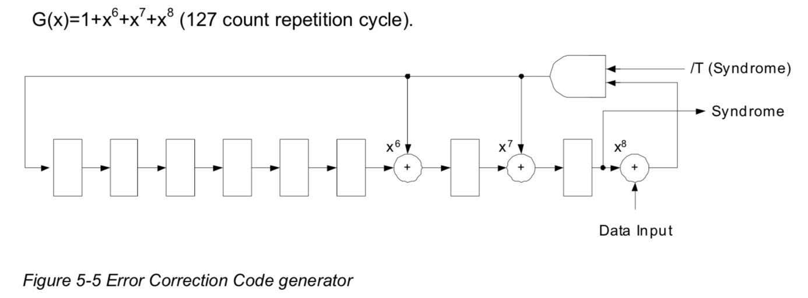

##Link Architecture

##Operating Modes Overview

共有3中mode： Video Data Period, Data Island period, and Control period. 

**Video Data Periods** use transition minimized coding to encode **8 bits per channel**, or 24 bits total per pixel.

**Data Island Periods** are encoded using a similar transition minimized coding, TMDS Error Reduction Coding (TERC4), which transmits **4 bits per channel**, or 12 bits total per TMDS clock
period.

**Control Periods**, **2 bits per channel**, or 6 bits total are encoded per TMDS clock using a transition maximized encoding. These 6 bits are HSYNC, VSYNC, CTL0, CTL1, CTL2 and CTL3.

* **TMDS Periods and Encoding**

* **encoding Type and Data Transmitted**

* **control period**

  These 6 bits are HSYNC, VSYNC, CTL0, CTL1, CTL2 and CTL3.其中CTL0, CTL1, CTL2 and CTL3称为preamble

  The Control Period is also used by the Sink for character synchronization.控制周期还有字符同步的功能。

  

The HDCP-specified Enhanced Encryption Status Signaling ENC_EN code (CTL0:3=1001) 。如果video是HDCP加密的，那preamble是CTL0:3=1001。

* **Video Data Period**

  the Video Data Period begins with a two character Video Leading Guard Band。以两个字符周期的leading guard band为开始标志。

  * **Video Leading Guard Band Values**

    

* **Data Island Period**

  The Data Island shall contain at least one packet, limiting its minimum size to 36 pixels. **最少36pixel**，2*2guard band + 32 packet length=36

  Islands shall contain an integer number of packets. In order to assure the reliability of the data within the Data Island, they shall be limited to 18 packets or fewer. 一个Data Island不应该包含超过18个packet。

  * **Data Island Leading and Trailing Guard Band Values**

    

  * **Data Island Packet Construction**

    Each Subpacket includes 56 bits of data and is protected by an additional **8 bits of BCH ECC parity bits**.

    Subpacket 0 bytes 0 through 6 (SB0-SB6) are also designated Packet bytes 0 to 6 (PB0-PB6). 

    Subpacket 1 bytes 0 through 6 (SB0-SB6) are also designated Packet bytes 7 to 13 (PB7-PB13). 

    Subpacket 2 bytes 0 through 6 (SB0-SB6) are also designated Packet bytes 14 to 20 (PB14-PB20). 

    Subpacket 3 bytes 0 through 6 (SB0-SB6) are also designated Packet bytes 21 to 27 (PB21-PB27). 

    

  * **Data Island Error Correction**

    To improve the reliability of the data and to improve the detection of bad data, Error Correction Code (ECC) parity is added to each packet. BCH(64,56) and BCH(32,24) are generated by the polynomial G(x) shown in Figure 5-5.

    