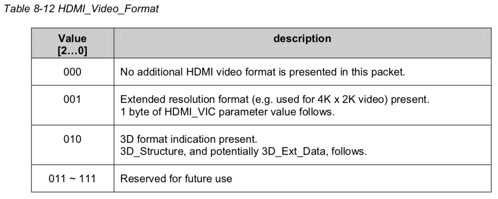
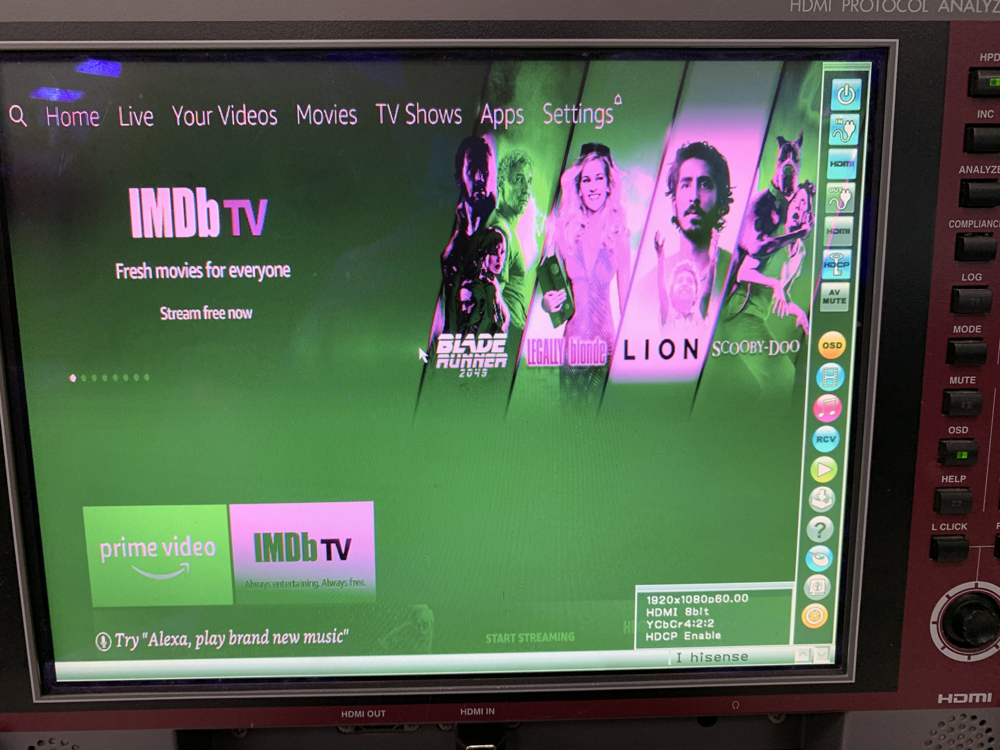

#Pixel Encoding and Color depth

##pixel encoding

1. Only pixel encodings of RGB 4:4:4, YCBCR 4:2:2, and YCBCR 4:4:4 (as specified in Section 6.5)may be used on HDMI. 这是HDMI 1.4的规定，HDMI 2.0引入了YCBCR 4:2:0。

2. 如果sink能够支持YCBCR 4:2:2 or YCBCR 4:4:4其中一种，那两种都必须能够支持。EDID block 1中byte 3有bit能够表明是否支持YCbCr。

   

3. Pixel mapping

   * **8-bit RGB 4:4:4**

     

   * **12-bit YCbCr 4:2:2**

     

   * **8-bit YCbCr 4:4:4**

## color depth

1. HDMI VSDB中有bit能够表明sink支持的color depth

2. if an HDMI Source or Sink supports any Deep Color mode, it shall support 36-bit mode.如果支持任意一种deep color，就必须支持36-bit deep color。

3. YCBCR 4:2:2 is  36-bit mode。它不支持其它的deep color mode，即YCBCR 4:2:2只能是36-bit。

4. All other HDMI protocol elements are unaffected by the Deep Color pixel packing. Data Islands, Video Guard Bands and Preambles occur as they do in normal (24-bit) mode – each Preamble is 8 TMDS clocks, each Data Island packet is 32 TMDS clocks, and each Guard Band is 2 TMDS clocks.  **Deep color只影响Video Data Period的位深，Data Island Period和Control Period不受影响**，依然是24bit，由于Data island依然是24bit，并且deep color的时候TMDS clock会按比例加快，所以传送原有Data Island的时间会缩短，也间接的拓宽了Data Island的带宽。

5. RGB444和YCbCr444均有24-bit,30-bit,36-bit,48-bit mode,而YcbCr422只有36-bit mode。

   * TMDS clock和pixel clock的关系

     

   * pixel packing phase

     

   * GCP (general control packet)

     The Source occasionally sends a General Control Packet (GCP)
     communicating the current color depth and the packing phase of the last pixel character sent **prior to the GCP**. When transmitting Deep Color, the Source shall send a General Control Packet (GCP) with an accurate CD field indicating the current color depth and with the PP field (PP0, PP1, PP2, PP3) indicating the packing phase of **the last pixel character (within the last Video Data Period) **sent prior to the GCP. **上一个Video Data Period中最后一个像素的packing phase**， 即上一行最后一个active video pixel的packing phase。根据spec的意思，GCP要在Video Data Period之后发(在传输CD和PP信息时，要在Video Data Period之后发；如果是传输AVMUTE，Clear_AVMUTE信息的时候，则要在VSYNC之后的384pixel之内就发出去)，不像audio infoframe，需要在audio sample packet发送之前就要发出去。**而在实际做法中，GCP每个field发一次，紧跟Vsync之后发，那PP就是上一个field最后一个像素的最后一个phase，所以肯定对应到20bit-phase0,30bit-phase4,36bit-phase3,48bit-phase2,即每种情况下的最后一个phase。PP是由hardware自己计算去填，CD和AVMUTE才有hdmi driver去填写。**

     如果Sink连续4帧没有收到GCP，它应该切换到24bit mode。

     

     ​	**1个GCP packet有4个完全一样的General Control Subpacket**

     

     1. 从source角度来说，CD为0，PP也要为0;从sink角度来说，CD如果为0，PP的值要被忽略不作处理。
     2. 当CD表明是24bit时，Sink也要忽略PP不处理。

###pixel repetition的2个理由：

1. Video formats with native pixel rates below 25 Mpixels/sec require pixel-repetition in order to be carried across a TMDS link. **720x480i and 720x576i video format timings shall always be pixel-repeated**.  由于TMDS不能传输低于25M的数据，原始pixel clock低于25M 的video format都必须采用pixel repetition
2. 为了获得足够的传输audio的带宽，也可以选择pixel repetition。

# Quantization Ranges

# Colorimetry

每种video format都有默认的colorimetry，如果不在AVI infoframe的C filed（C1，C0）中表明当前传输的colorimetry，那Source就要保证所传输的video使用的是默认的colorimetry，而Sink也要把收到的video当默认的colorimetry处理。

SMPTE 170M; ITU-R BT.601; ITU-R BT.709; xvYCC...

# AVI InfoFrame

 Source应该一直发AVI InfoFrame，至少每两个field发一次。

> spec规定至少每两个field发一次，但实际做法是每个field发一次，对Progressive video format，即每帧发一次，对Interlace video format而言，即Odd，Even field各一次。实际做法中，AVI infoframe被放到紧跟VSYNC之后。

当Sink的HDMI VSDB中CNC bit具有某种（Graphics，Photo，Cinema，Game）内容的特殊处理模式时，并且Source知道当前video来源时，才会把AVI infoFrame中的ITC和CN1，CN0设置成非0，否则应该设置成全0（No Data）。 这样时方便Sink对某些特殊video内容做特殊处理。

# HDMI VSIF 

HDMI VSIF主要有两个功能：

1. 4k x 2k
2. 3D

如果要发HDMI VSIF，至少每两个field发一次。

当AVI InfoFrame中包含了VIC，而HDMI VSIF中包含了HDMI_VIC(for 4k x 2k) ,Sink应该使用HDMI VSIF中的HDMI_VSIF。

## 3D video format structur

如果HDMI VSIF for 4k x 2k，只看HDMI_VIC即可。

如果HDMI VSIF for 3D，要结合AVI InfoFrame中的VIC值和HDMI VSIF中的3D structure。

### frame packing

### side-by-side

### Top-and-Bottom

# GCP

1. GCP有4个完全一样的subpacket。

2. General Control packets indicating Set_AVMUTE or Clear_AVMUTE may only be transmitted between the active edge of VSYNC and 384 pixels following this edge.  

   要Set_AVMUTE或者Clear_AVMUTE的时候，要在VSYNC之后的384个pixel之内发送GCP。但如果时表示Deep Color，需要在video data period之后发GCP。**在实际做法中，无论是表示deep color还是AVMUTE，GCP每个field发一次，紧跟Vsync之后发，那PP就是上一个field最后一个像素的最后一个phase，所以肯定对应到20bit-phase0,30bit-phase4,36bit-phase3,48bit-phase2,即每种情况下的最后一个phase（PP是固定的）。PP是由hardware自己计算去填，CD和AVMUTE才有hdmi driver去填写。**

3. The General Control packet’s Set_AVMUTE and Clear_AVMUTE flags may be used by a Source to reduce the negative impact on the Sink of TMDS clock changes or interruptions. Use of the AVMUTE function may prevent spurious pops or noises in the audio during these clock changes.

   AVMUTE就是告诉Sink，当前video audio无效，应该mute。可以利用AVMUTE来避免闪屏或者pop noise。
   
   > 实际情况中，有些Rx电视行为做的不好，在接到AVMUTE之后，有可能把画面处理成绿屏而非黑屏。所以，与其依赖AVMUTE让电视去出黑屏，还不如在Tx这边就把video处理成黑屏画面，这样肯定不会出错。

# InfoFrame

# AVI InfoFrame & GCP test

1. AVI infoFrame test

   * 原始RGB444图像，修改AVI infoFrame Y1 Y0 field，画面均偏绿

     **原始RGB444图像** 

     

     **RGB444-YCbCr444图像**

     

     **RGB444-YCbCr422图像**

     

   * 原始YCbCr444图像，修改AVI infoFrame Y1 Y0 field

     **原始YCbCr444图像**

     

     **YCbCr444-RGB图像，颜色偏紫红**

     

     **YCbCr444-YCbCr422图像，颜色偏暗绿**

     

     ​	

   * 修改AVI InfoFrame中SC1 SC0 field（overscan, underscan），对Astro1831 Analyzer，画面没有变化；对Sony TV，SC1 SC0=01（overscan），会丢失掉一些边缘的有效画面，SC1 SC0=10（underscan），不会丢失acitve pixel。

   * 修改AVI InfoFrame中的B1 B0 field和Top Bar，End Bar，Left Bar，Right Bar field，Astro1831 Analyzer和Sony TV画面均无变化，大部分Rx都不对Bar信息作处理？

   * 修改AVI InfoFrame中M1 M0（picture aspect ratio）和R3 R2 R1 R0（active aspect ratio），Astro1831 Analyzer画面无变化，Sony TV会调整宽高比，例如原始画面是FHD 16:9，修改M1 M0和R3 R2 R1 R0变成4:3，Sony TV画面会变成4:3，左右两侧用黑色区域填充。

   * 修改AVI InfoFrame中VIC field，Astro1831 Analyzer和Sony TV画面均无变化。

   * 修改AVI InfoFrame中PR3 PR2 PR1 PR0 field，Astro1831 Analyzer和Sony TV画面均有细微变化，横向上的粒度变大，即横向上的清晰度下降。可能是Pixel Repetition的时候，Rx会每隔一列取一次有效数据然后拉长成整幅画面，横向清晰度下降。

2. GCP test

   * 修改GCP color depth field，例如实际video 10bit，而GCP color depth field改成是8bit，Astro1831 Analyzer和Sony TV画面均变糊，Analyzer可以看出timing异常（Horizontal方向timing异常，Vertical方向timing不受影响)

     **实际video 10bit，而GCP color depth 8bit**

     

