##HDMI 2.0新增packet类型

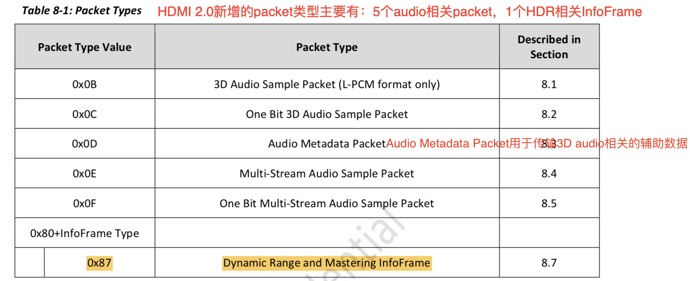

##HDMI 2.0 AVI InfoFrame的改变

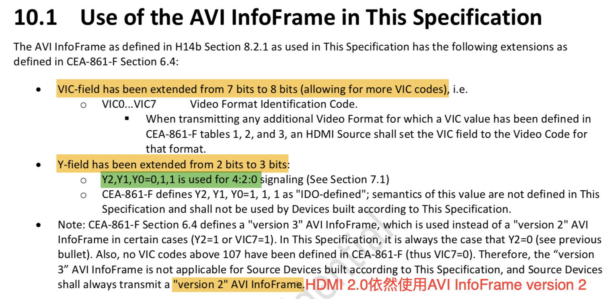

## HF-VSIF

**在HDMI 2.0中，HF-VSIF主要是用来传输3D相关信息**，如果用到Table 10-1中的feature，必须发HF-VSIF，每field一次。

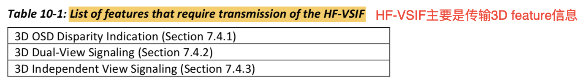

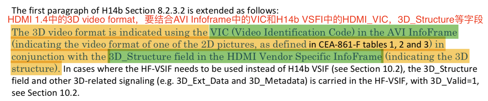

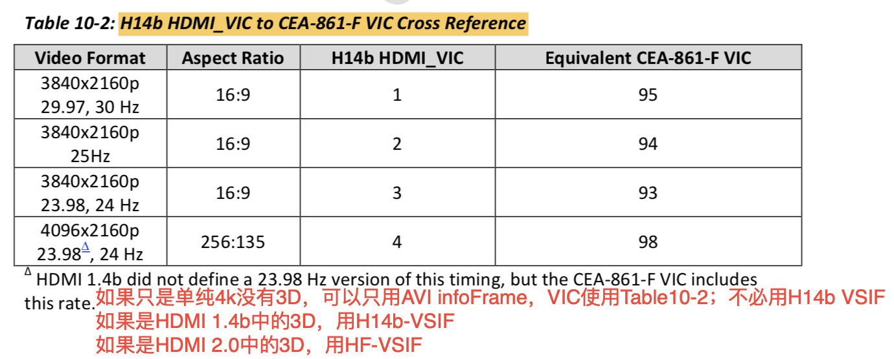

###HF-VSIF定义

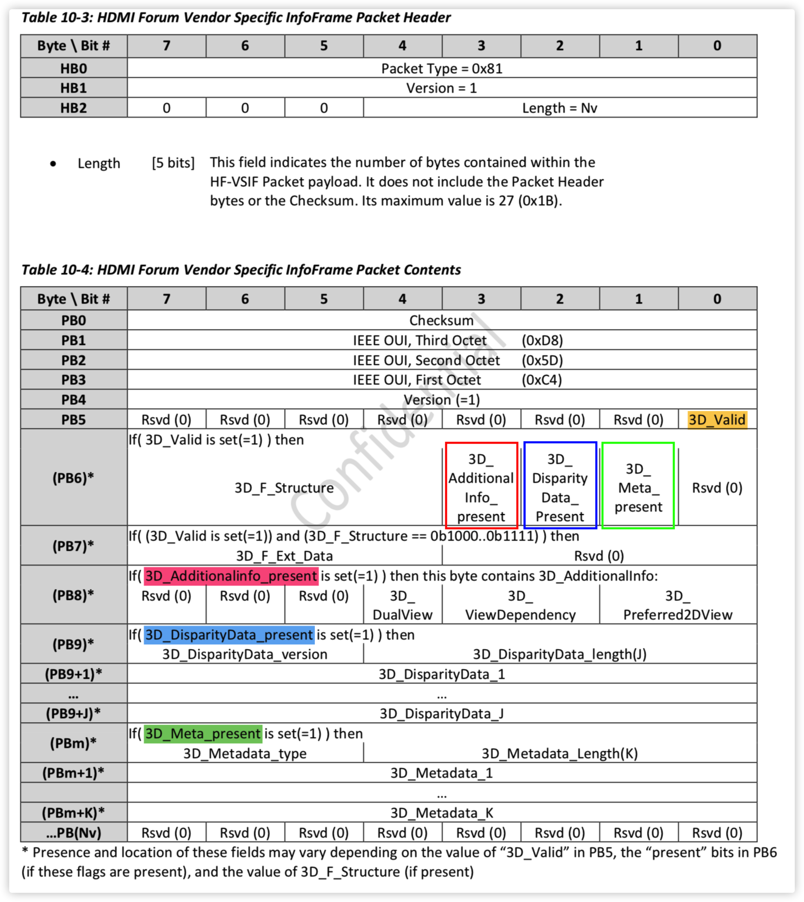

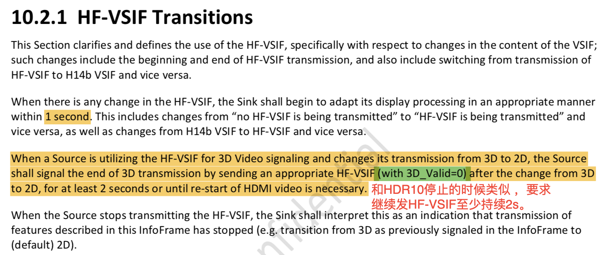

# E-EDID 

##Signaling of supported Video Formats

## HF-VSDB

**HDMI Forum Vendor Specific Data Block**

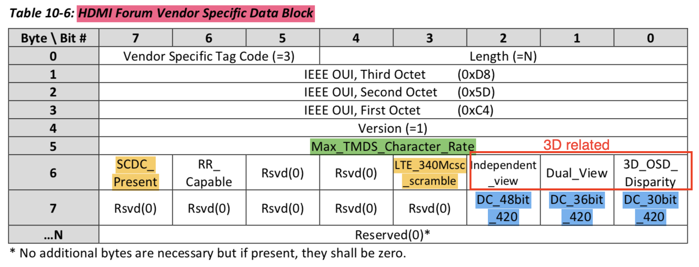

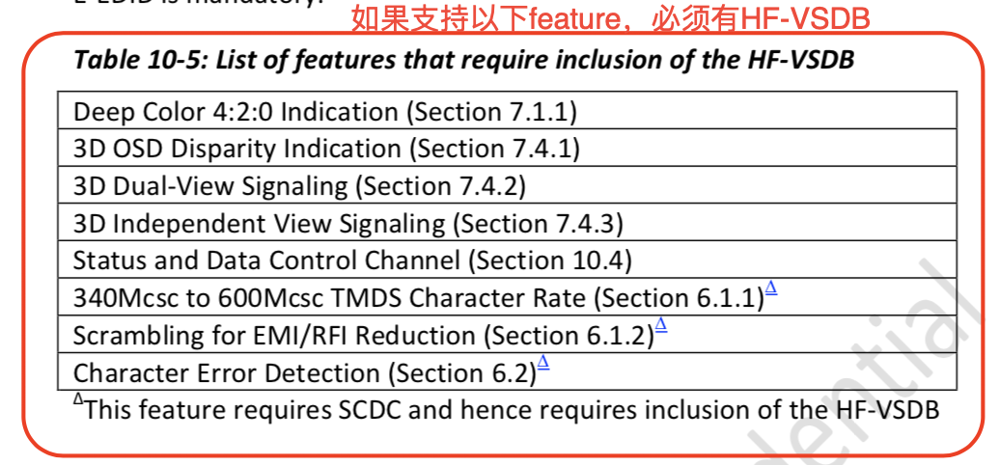

##HDMI Audio Data Block

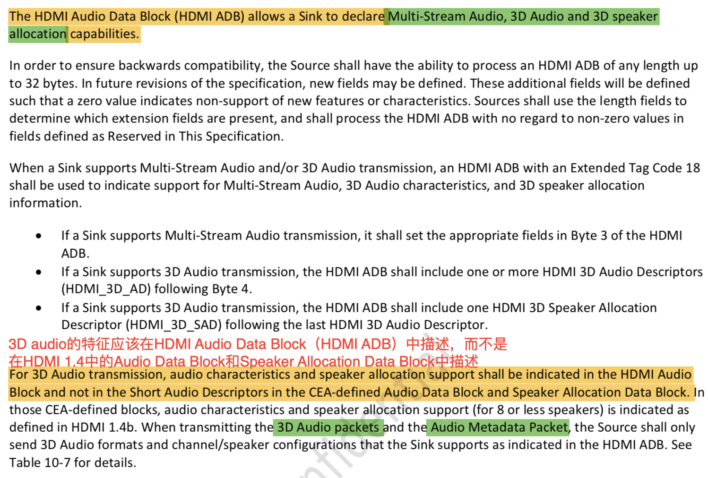

# Status and Control Data Channel

**EDID    0xA0/0xA1 —>0x50**
**HDCP   0x74/0x75 —>0x3A**
**SCDC   0xA8/0xA9 —>0x54**

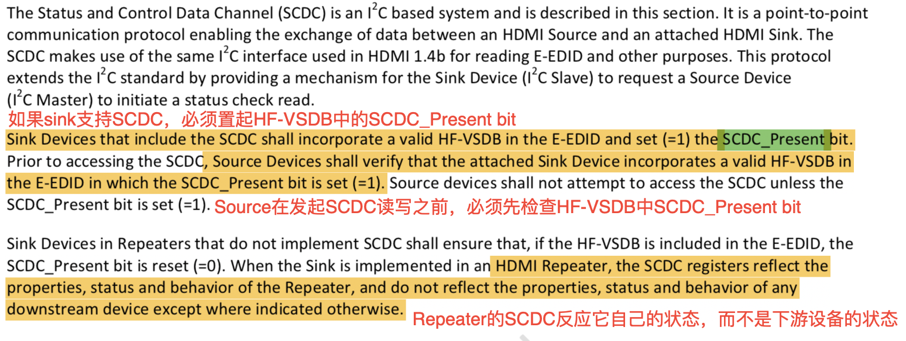

##Status and Control Data Channel Structure

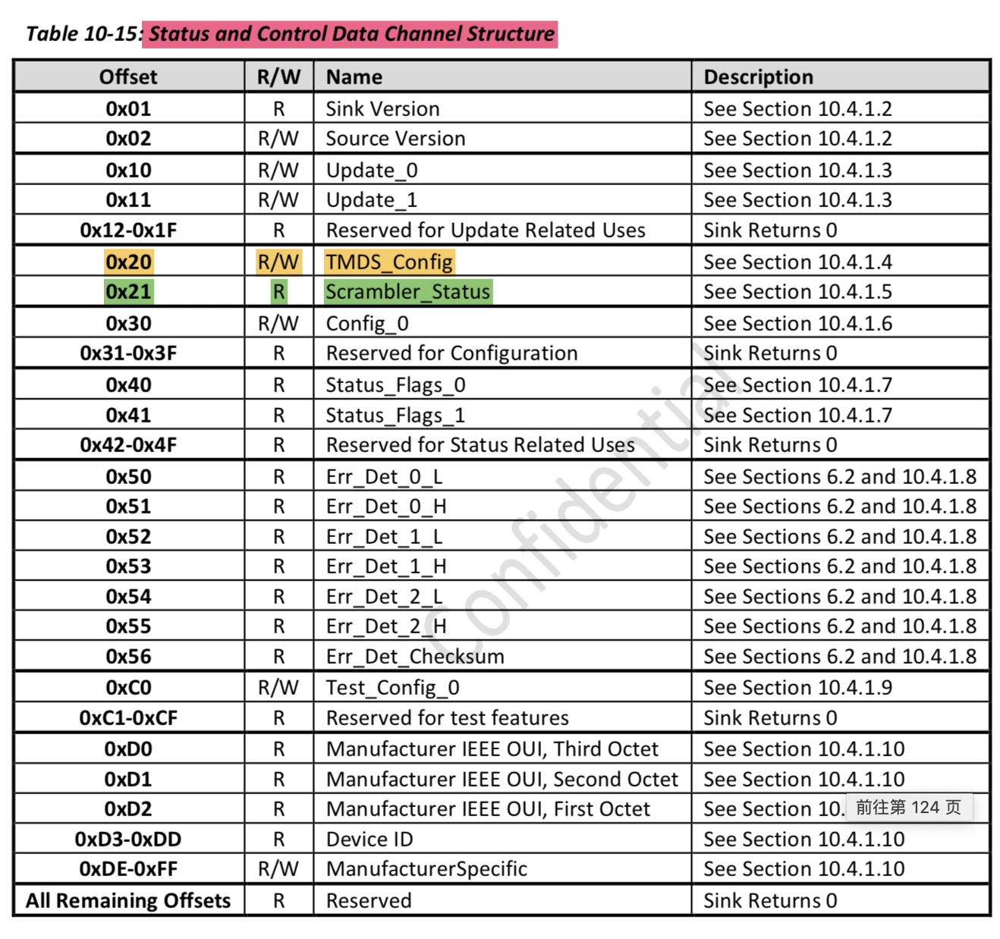

###Update Flag

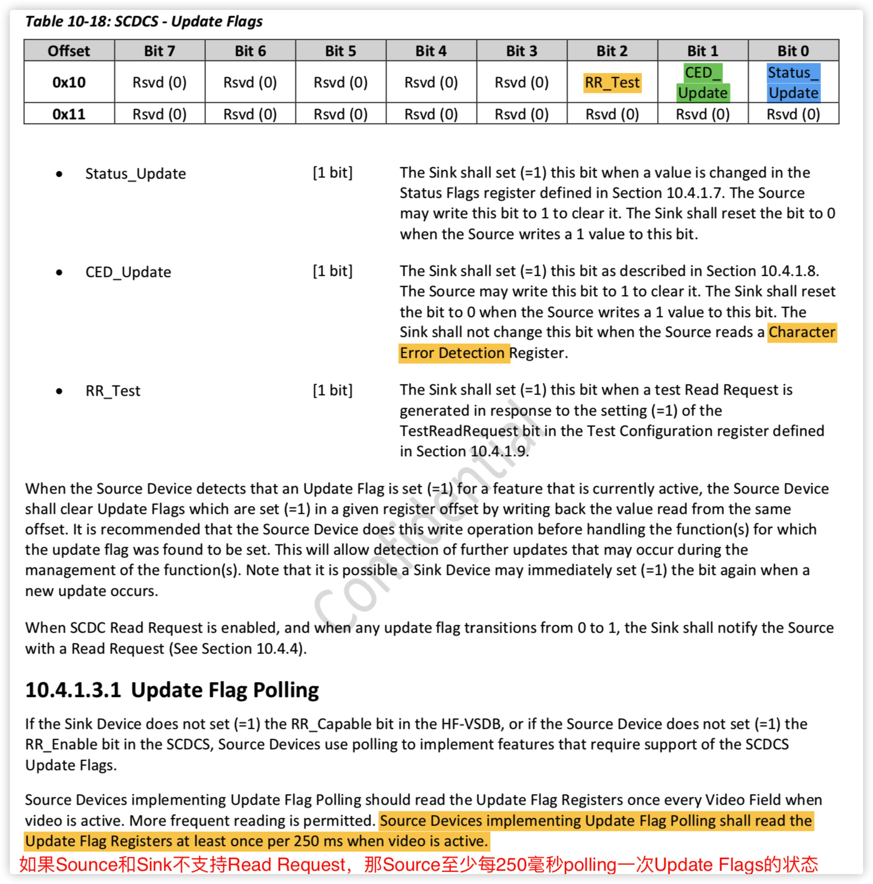

### TMDS Configuration

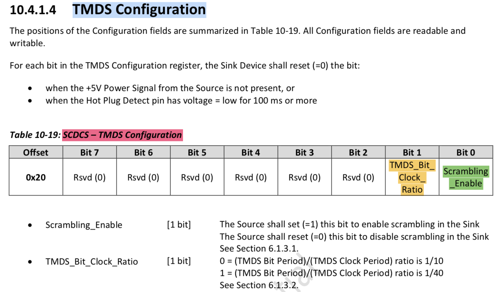

###Scrambler Status

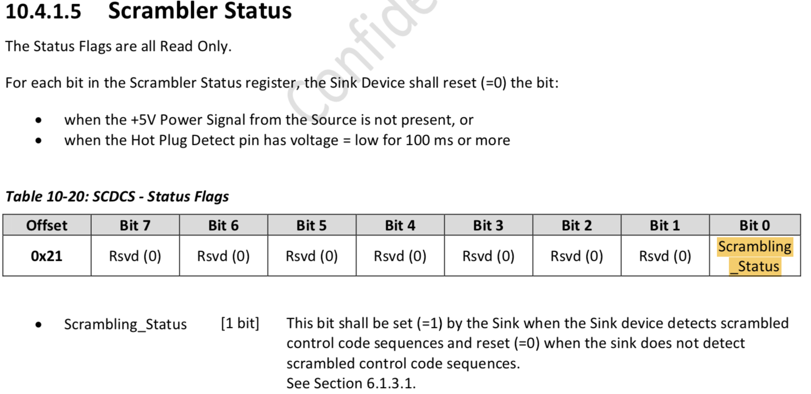

### Status Flags

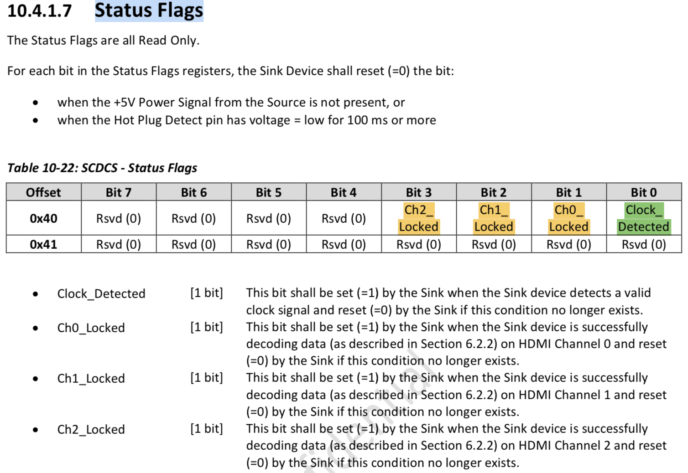

### Character Error Detection

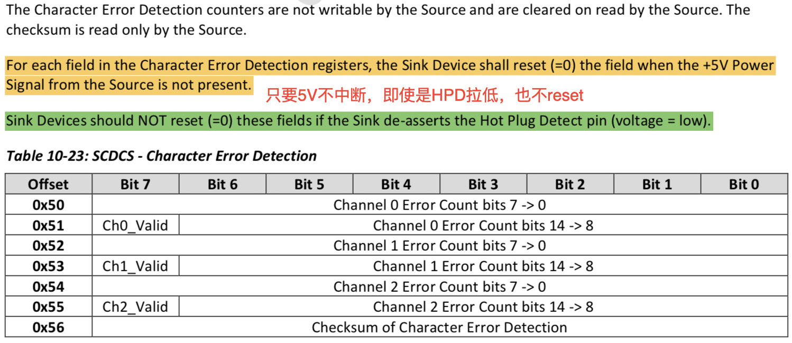

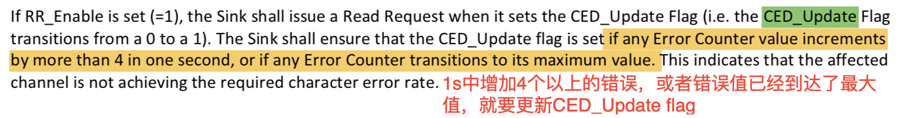

#Auto Lipsync Correction Feature

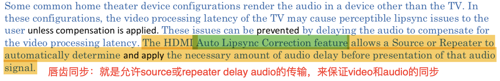

对一般设备来讲，video latency 都会大于audio latency，因为video数据量大，因此video processing的时间长。一般要求，audio数据要在和它相关的video数据传输完成+-2ms内传输完成。