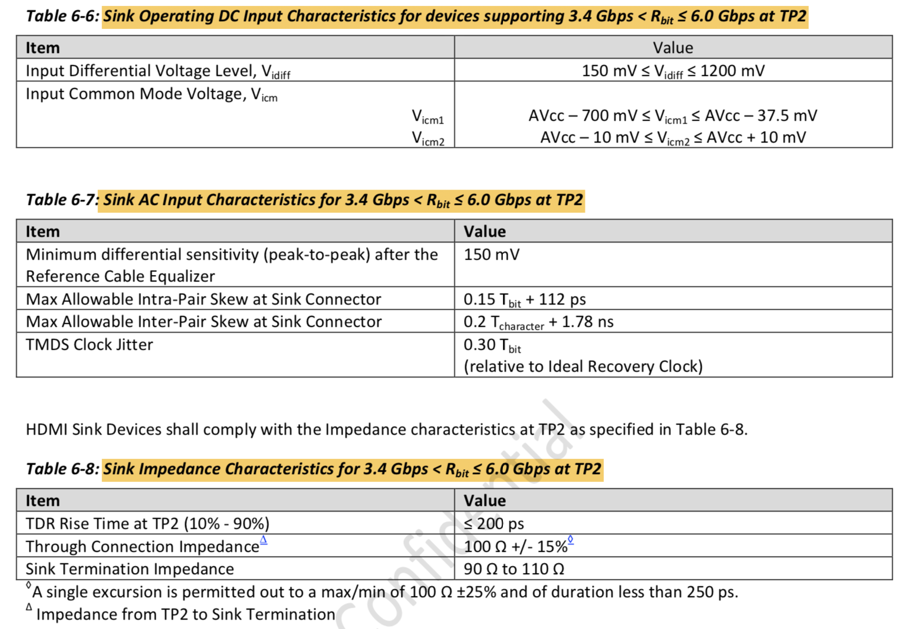

##340 Mcsc to 600 Mcsc TMDS Character Rate Support

HDMI 1.4 character rate最高只到340Mcsc， HDMI 2.0拓展到600Mcsc.

For TMDS Character Rates above 340 Mcsc, the TMDS Clock Rate shall be one fourth (1/4) of the TMDS Character Rate.

### TMDS Electrical specification

* **TMDS测试连接图**

* **HDMI Source TMDS Characteristics**

  

  

  

* **HDMI Sink TMDS Characteristics**

  

  

  

  

