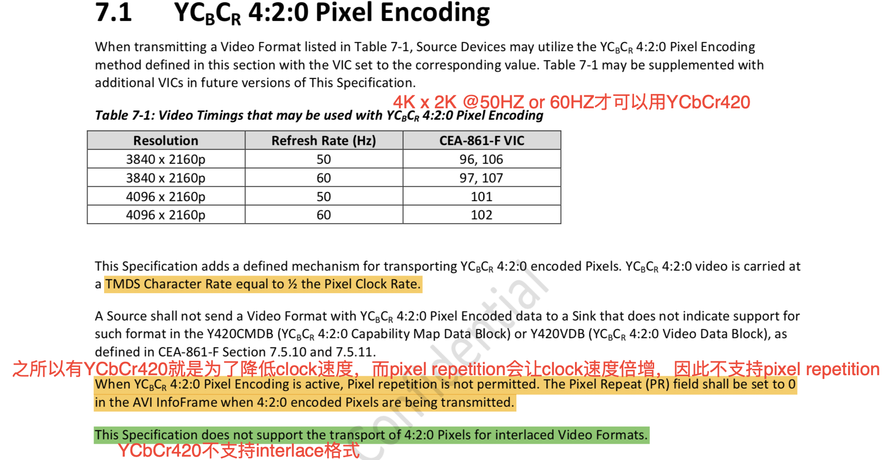
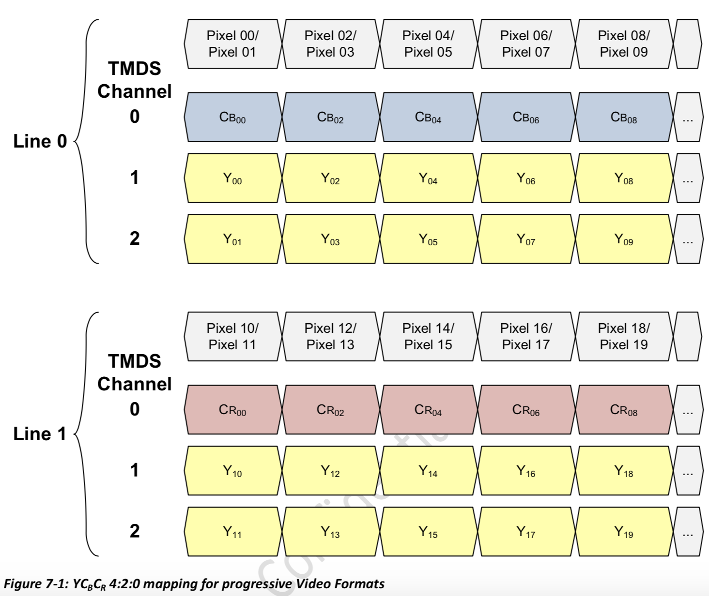
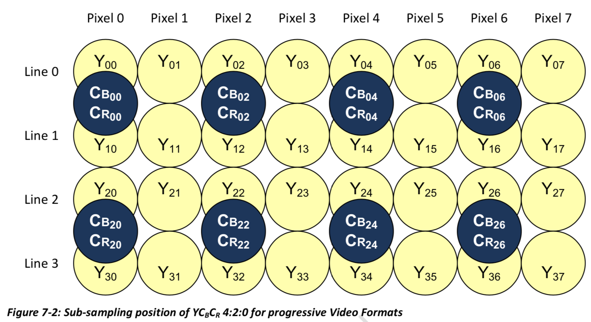
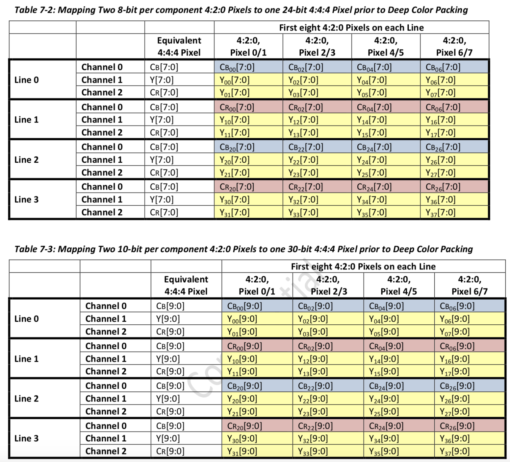
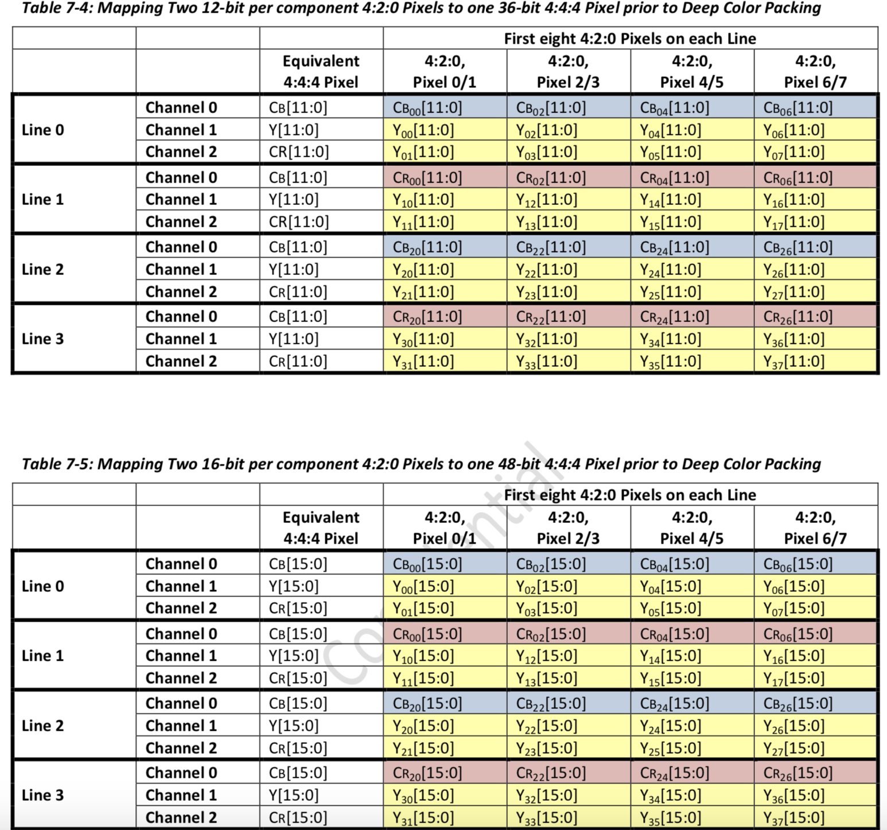
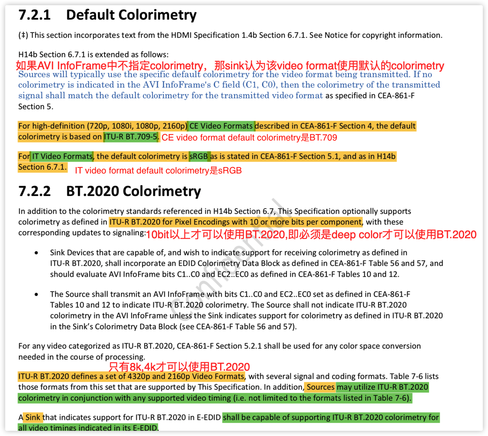
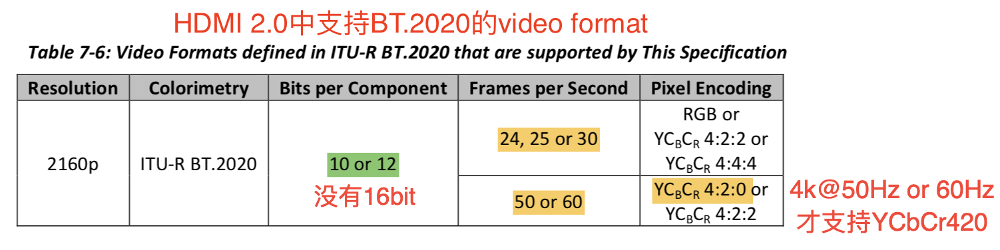
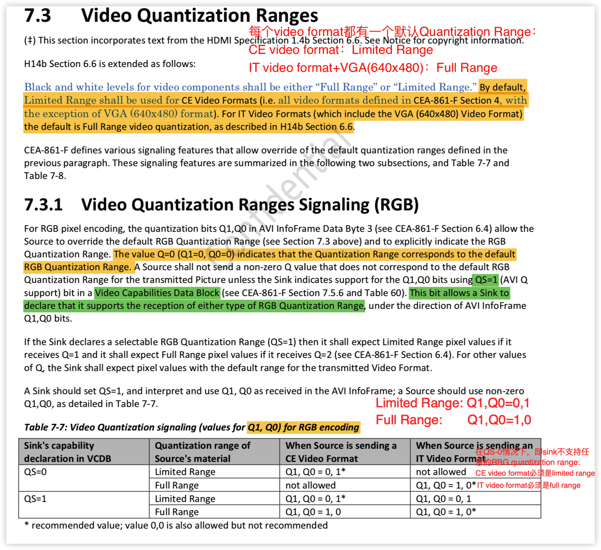
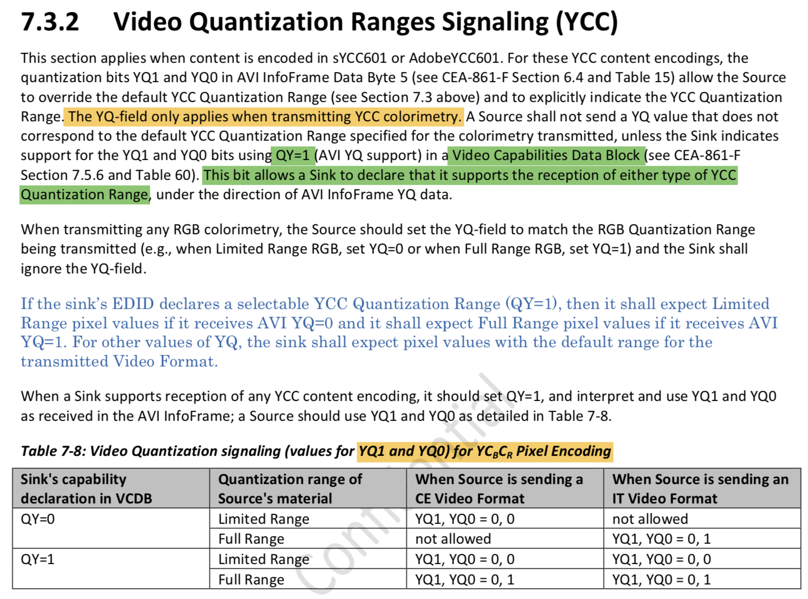

HDMI 1.4b—CEA-861-D
HDMI 2.0 —CEA-861-F

HDMI 2.0新增YCbCr420的pixel encoding方式，新增BT2020的colorimetry

##YCbCr420 pixel encoding

A Sink that indicates support for Deep Color 4:2:0 Pixel Encoding, shall support it on all Video Formats  indicated in the**Y420CMDB (YCBCR 4:2:0 Capability Map Data Block)** and **Y420VDB (YCBCR 4:2:0 Video Data Block)**, as defined in **CEA-861-F** Section 7.5.10 and 7.5.11, unless that combination exceeds the Max_TMDS_Character_Rate indication in the HF-VSDB (See Section 10.3.2).

Sink EDID Block1中的YCBCR 4:2:0 Capability Map Data Block和YCBCR 4:2:0 Video Data Block会表明哪些video format能支持YCbCr420。

##YCbCr420 deep color

YCbCr420的这种deep color数据传输格式，和RBG444，YCbCr444的deep color传输格式是相似的。

## Colorimetry

## Quantization Range

