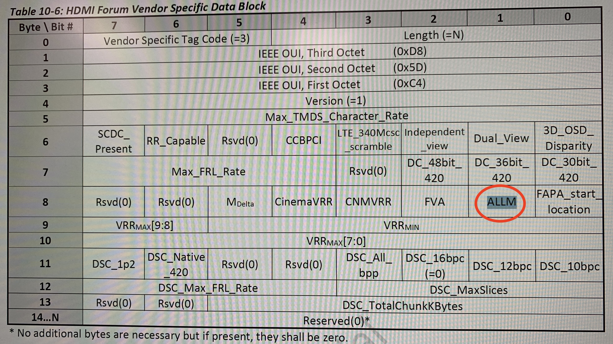
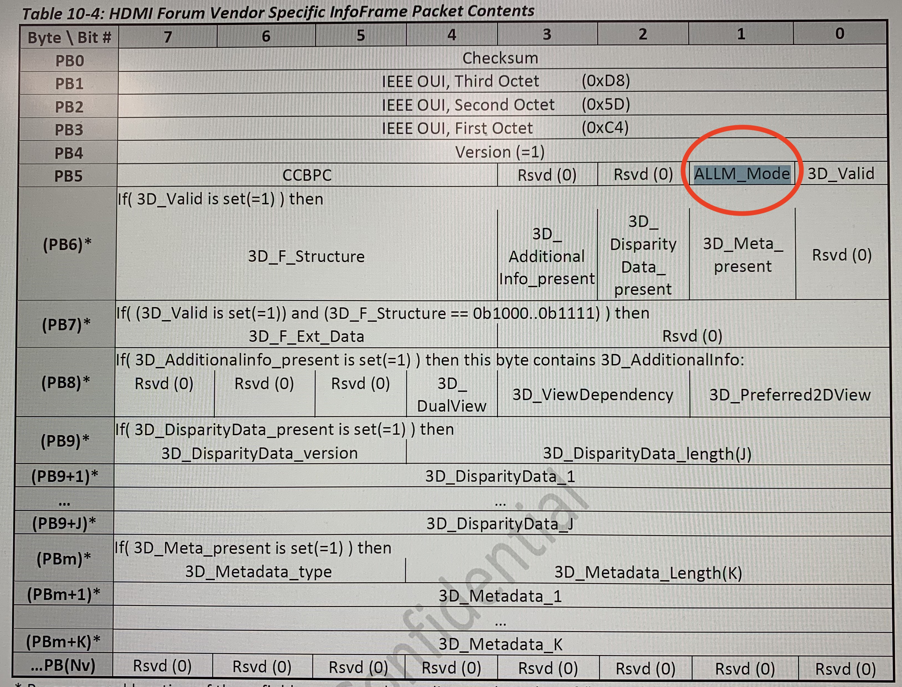
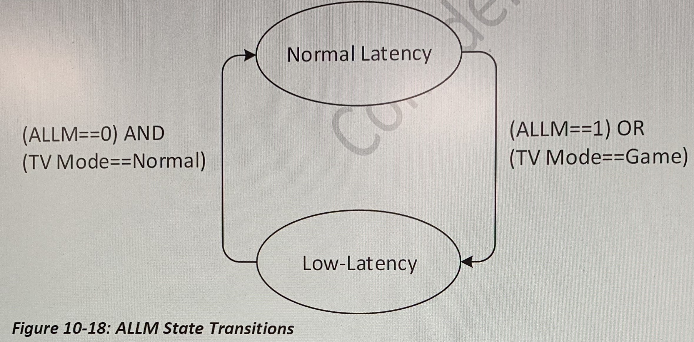
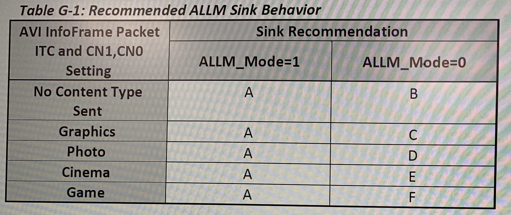

# Auto Low-Latency Mode

Auto Low-Latency Mode (ALLM) allows a Source to enable or disable a Sink's low-latency mode feature automatically without requiring the user to navigate a Sink's menus to set the optimal latency for their content. For more information, see Appendix G.

**不需要在Rx的导航栏菜单里面去选择low-latency mode，可以由Tx自动打开Rx的low-latency mode**

A Sink that supports a feature for reducing latency may support ALLM. A Sink that supports ALLM may have its low-latency mode enabled and disabled either: a) manually via menu navigation, or b)automatically via the ALLM feature.

**Sink有两种方式进入low-latency mode:**

1. **导航栏菜单里面进行选择**
2. **ALLM，由Tx直接发起**

Sinks supporting ALLM shall set(=1)the ALLM bit in the HF-VSDB (see Section 10.3.2)

**Sink如果支持ALLM，必须在HF-VSDB中置起ALLM bit**

If the ALLM bit is set (=1) , a Source may set(=1) the ALLM Mode bit in the HF-VSIF. A Source shall not set the ALLM bit in HF-VSIF unless the ALLM bit is set(=1)in the Sink's HF-VSDB.

**Source通过置起HF-VSIF中的ALLM_Mode bit来enable或disable ALLM feature**

Figure 10-18 shows how Sinks should change their low-latency mode based on input variables. Transition from a non-low-latency mode to a low-latency mode is the logical OR of ALLM Mode and the Sink's menu setting: if the Source transmits ALLM_ Mode=1 OR the user selects a low-latency mode in the Sink, then the Sink shall transition to its low-latency mode. If the Source is transmitting ALLM- Mode=0 AND the user has selected a non-low-latency mode, the Sink shall transition to its previous mode. Implementing a menu setting for low-latency mode in the Sink is optional; in such a case, low-latency mode is driven only by ALLM Mode.

**一般来讲，Sink是否进入low-latency mode，由ALLM和Sink导航栏菜单配置的LLM共同决定，采用逻辑或的方式。例如ALLM=1或者导航栏菜单也是enable，那么Sink进入low-latency mode；如果ALLM=0并且导航栏菜单是disable，那么sink回到non-low-latency mode。 另一种情况是，如果Sink导航栏菜单里面没有设置low-latency的选项，那Sink是否进入LLM完全由ALLM决定**

When an ALLM capable Sink receives an HF-VSIF with ALLM_Mode set(=1), it should enable its low-latency mode within 1 second. A Sink shall exhibit the same behavior whether its low-latency mode is enabled due to ALLM signaling or through use interatction(e.g. using on-screen menus). If a  Sink's Low-Latency mode is already enabled, either manually or automaticatically, the receipt of an HF-VSIF with ALLM Mode set (=1)shall have no discernible effect on the presentation of video or audio.

**从non-low-latency进入low-latency mode，要在1s内进入low-latency模式；此外，如果本来就是low-latency模式，不应对其有影响**

When the Sink receives an HF-VSIF with ALLM_Mode cleared (=0) and user interaction is not requesting low-latency mode, the Sink should revert to its previous mode within 1second. For example, if a display is

in "Cinena" mode and ALLM changes to =1, the display should change to its low-latency mode(say, "Game"). When ALLM changes again(=0), the display should go back to "Cinema"mode. If the user had already selected low-latency mode, then ALLM transition shall have no discernible effect.

**同样，退出low-latency mode也要在1s内完成**

To prevent disruption of the user's audio/video experience, when ALLM causes the low-latency mode to change, the Source shall not display a notification message. 

**为了不影响用户的音视频体验，在做low-latency和non-low-latency之间的切换时，source不应该显示通知消息（在切换过程中，source不应该对画面叠加通知OSD画面），这句话中有没有不应该发CEC OSD message的意思？**

To prevent disruption of the users audio/video experience, when ALLM causes the low-latency mode to change, the Sink should limit video and audio content not directly derived from the video and audio received from the Source. Unrelated video(e. g. black or corrupted sceen, a notification message, etc.)shall not be displayed for more than one second. Unrelated audio (e.g. indication chimes, clicks, pops, etc.) shall not be rendered. After the Sink receives at HF-VSIF with ALLM Mode set (=1)and changes the latency setting, the new latency setting shall persist until there is a mode change, HF-VSIF packets are no longer sent, or there is a hot-plug event.

**为了不影响音视频体验，为了不受在non-latency和low-latency之间切换的影响，Sink在短时间内不应该直接从Source拿video和audio。不相关的video画面展示不应该超过1s，不相关audio不应播出。进入low-latency mode之后，除非HF-VSIF中ALLM_Mode bit有变化或者在导航栏菜单里面重新选择，除非重新插拔，否则都不应该退出low-latency mode**

Devices that implement ALLM should implement the mechanisms defined in This Specification for synchronizing Audio and Video, See Dynamic Auto Lip Sync(Section 10,7. 2) for more information.

##Appendix G Auto Low-Latency Mode( Informative)

Auto Low- Latency Mode (ALLM)(Section 10. 11) is a control feature that allows a Repeater or a Sink with a low latency Mode (LLM) (commonly called the"Game Mode" feature) to entrust the configuration of that feature to the Source device as opposed to the user. This allows the Source to anticipate the users preference based on the of the experience, and then forward that preference downstream to Repeaters and Sinks on behalf of the user. The feature thus off-loads the user from having to manually change the settings in various downstream Repeaters and Sinks using those devices' individual menus and remotes when the user switches between different types of content. For example, a user could be watching a movie when they receive an incoming video call. The Source could pause the commencement of the video call. When the user completes the call and wishes to resume playback of the movie, the ALLM feature can be used to return the devices back to their normal- latency configuration.

Downstream Sinks and Repeaters may disable some picture enhancement modes to achieve a lower latency. **Sink可能会关掉图像增强等效果来达到低延迟的目的。**Therefore, automatic activation of other devices' Low-Latency Modes should only be considered for applications that would truely benefit. If the application is latency-sensitive(e. g, game, video conferencing, etc. ) the Source should enable LLM using the ALLM feature. If the application is not latency-sensitive(e.g. movie, TV, etc.), the source should disable LLM using the ALLM feature. If the application changes (e. g, movie to/from game), the Source should enable or disable LLM using the ALLM feature as appropriate for the new application. **如果Source当前播放的是游戏，即时视频通讯等low-latency敏感的video，Source可以修改ALLM_Mode bit让Sink进入low-latency mode；如果Source播放的是电影等low-latency不敏感的video，Source可以disable ALLM_Mode bit让Sink退出low-latency mode。**

##The Relationship Between ALLM and the Content Type Feature

The Content Type feature a llows the Source to inform downstream Devices when it deems that the content falls into one of four special categories: "Graphics", "Photo", "Cinema", or "Game". CTA 861-G provides recommendation for Sink Signal processing that would be the most appropriate for content htat has been placed into these categories. For example, it states, "when the IT content bit is set to 1 and the Game type is indicated, the Sink should "pass-through" game content with minimal scaling and picture enhancement  in order to avoid undesirable artifacts. Audio and video latency should be minimized. The Game type should not be associated with device type. For example, game machines are capable of supplying various content types such as DVD movies. **Content Type允许Source对不同内容做不同声明，然后Sink按内容不同做不同处理；而ALLM不区分内容，不管什么内容Source都可以让Sink进入low-latency mode，只是一般来讲，Source在播放Game，Video Conference才会置起ALLM_Mode bit。**

When content does not fall into one of the predefined Content Type categories, the Content Type feature does not make any recommendations. ALLM provides a mechanism for entering into a low-latency mode in these cases. For example, ALLM can be used in applications that will be benefit from reduced latency but where content is not game content, such as video conferencing and touch applications.

Table G-1 summarize recommended operation for Sink as function of the AVI InfoFrame Packet ITC and CN1,CN0 settings

Recommendation A: Assume that the content delivered is of high image quality and does not need additional image processing to improve it. Present the images with the lowest latency possible.

Recommendation B: Strive to deliver an optimal balance between best picture quality and low-latency. The right balance may depends on the target market for the device.

Recommendation C-F: Refer to CTA-861-G Section 6.4(fields ITC and CN)

ALLM does not replace the Content Type feature.

A both the ALLM and Content Type feature are optional, an adopter may implement neither, either, or both of these features.

**ALLM不取代Content Type feature，这两个feature都可以自由选择搭配。**