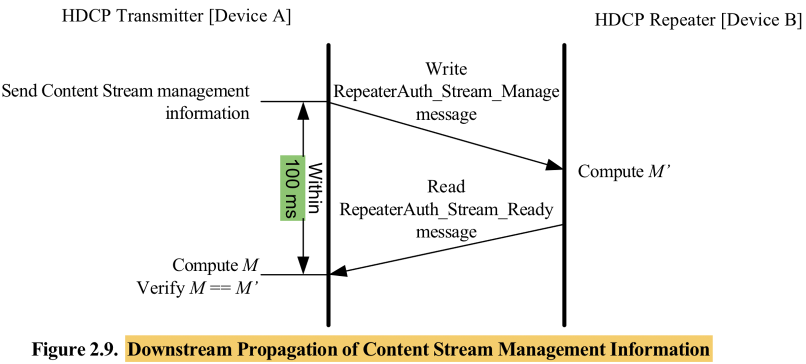
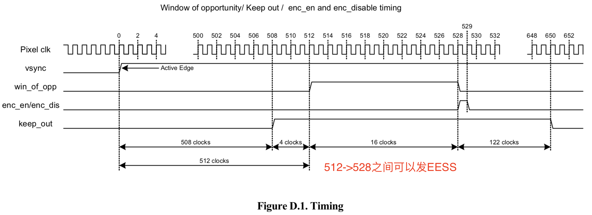

The HDCP System allows up to four levels of HDCP Repeaters and as many as 32 total HDCP Device。

**HDCP 1.4最多7层128个HDCP device，HDCP 2.2最多4层32个HDCP device**

The concatenation operator ‘||’ combines two values into one. 拼接符号，不是位或

# Authentication Protocal

###Key

### AKE

###LC

### SKE

###Authentication with Repeaters

* **Upstream Propagation of Topology Information**

1. ReceiverID list不包含Repeater本身的Receiver ID，在HDCP 1.4中，KSV list也不会包含Repeater本身KSV
2. Rx在准备好ReceiverID list后，置起READY bit，并填写正确的Message_Size
3. Tx要在在SKE完成之后，才设置3s timer来polling READY bit
4. HDCP Receiver要在置起READT bit之后的2s内收到RepeaterAuth_Send_Ack message，如果Rx察觉V V’不匹配，要置起REAUTH_REQ bit
5. DEVICE_COUNT包含Repeater本身和其下游设备的数量
6. HDCP 2.2系统最多支持32个HDCP device，4层。所以Repeater DEPTH最大为4，DEVICE_COUNT最大31。如果有MAX_DEVS_EXCEEDED或MAX_CASCADE_EXCEEDED error，Tx不要再从Rx读RepeaterAuth_Send_ReceiverID_list
7. 一旦Repeater下游设备拓扑结构有变化(例如有新设备plug in，或者有设备plug out)，Repeater要重新置起READY bit，Tx要重新读RepeaterAuth_Send_ReceiverID_List。不需要从AKE_Init重新开始

* **Downstream Propagation of Content Stream Management Information**

1. The HDCP Transmitter must write the RepeaterAuth_Stream_Manage message specifying Type
   value assigned to the Content Stream, to the attached HDCP Repeater **at least 100ms** before the
   transmission of the corresponding Content Stream after HDCP Encryption. **Tx要在开始发送加密数据至少前100ms，发 RepeaterAuth_Stream_Manage指定stream type**
2. Type 0可以发给下游的所有HDCP设备，Type 1不能发给下游的1.x的设备和2.0 repeater

### Link Integrity Check

### Renewability

1. The HDCP Transmitter is required to manage system renewability messages (SRMs) carrying the
   Receiver ID revocation list.**只有Tx才需要保存SRM信息**，repeater和Rx不需要
2. For interoperability with HDCP 1.x, KSVs of revoked HDCP 1.x devices will be included in the HDCP 2 SRM, in addition to the HDCP 1.x SRM. Similarly, Receiver IDs of revoked HDCP 2 devices will be included in the HDCP 1.x SRM, in addition to the HDCP 2 SRM.**为了兼容1.4和2.2，HDCP 1.4和HDCP 2.2的revocation list也会被包含在对方的SRM中**
3.  SRM integrity check and revocation check are performed only by the top- level HDCP Transmitter. **在AKE阶段，只有最顶端的Tx做SRM和Revocation Check**

### HDCP port

**I2C 器件地址 0x74**

# HDCP Cipher

1. *inputCtr* is initialized to zero when HDCP Encryption is enabled for the first time during the
   HDCP Session i.e. at the first encryption enable (ENC_EN) immediately after SKE.
   FrameNumber must not be reset at any other time. DataNumber is reset to 0 at every ENC_EN
   (corresponds to at every frame boundary). HDCP Encryption of data symbols begins with an
   *inputCtr* value of zero. *inputCtr* does not change for frames which are not encrypted.

   **第一次开始加密的时候，inputCtr被初始化成0。FrameNumber每发一次ENC_EN加1（即每帧加1），DataNumber在ENC_EN之后初始化成0（即每帧会清零一次），DataNumber在HDCP cipher每产生128bit key stream一次就加1。在此之后，FrameNumber不应该reset，除非重做HDCP**

2. The value of *inputCtr* must never be reused for a given set of encryption parameters i.e. *ks* and *riv*.这一句表明，如果Ks，riv发生了改变（即重做SKE，也即重做HDCP），inputCtr应该重新计算。即如果重做HDCP（包含重做SKE，会重新生成Ks和riv），那么inputCtr会从零开始计算

## EESS

**和HDCP 1.4完全一样**

