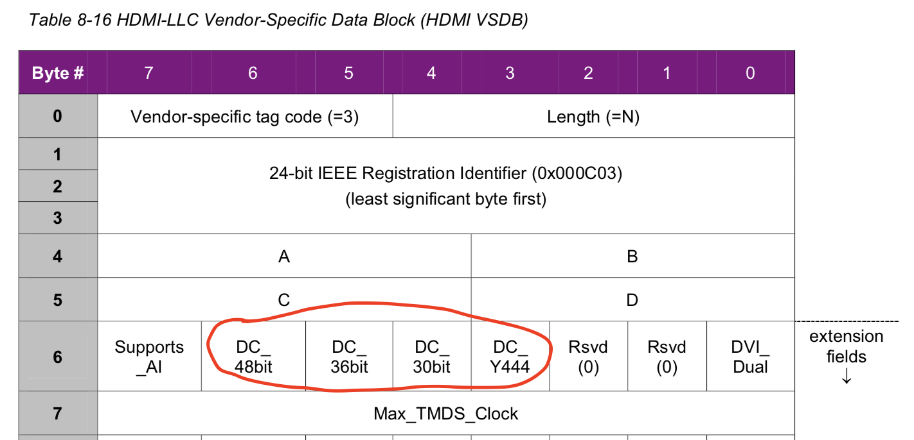

#Pixel Encoding and Color depth

##pixel encoding

1. Only pixel encodings of RGB 4:4:4, YCBCR 4:2:2, and YCBCR 4:4:4 (as specified in Section 6.5)may be used on HDMI. 这是HDMI 1.4的规定，HDMI 2.0引入了YCBCR 4:2:0。

2. 如果sink能够支持YCBCR 4:2:2 or YCBCR 4:4:4其中一种，那两种都必须能够支持。EDID block 1中byte 3有bit能够表明是否支持YCbCr。

   

3. Pixel mapping

   * **8-bit RGB 4:4:4**

     

   * **12-bit YCbCr 4:2:2**

     

   * **8-bit YCbCr 4:4:4**

## color depth

1. HDMI VSDB中有bit能够表明sink支持的color depth

2. if an HDMI Source or Sink supports any Deep Color mode, it shall support 36-bit mode.如果支持任意一种deep color，就必须支持36-bit deep color。

3. YCBCR 4:2:2 is  36-bit mode。它不支持其它的deep color mode，即YCBCR 4:2:2只能是36-bit。

4. All other HDMI protocol elements are unaffected by the Deep Color pixel packing. Data Islands, Video Guard Bands and Preambles occur as they do in normal (24-bit) mode – each Preamble is 8 TMDS clocks, each Data Island packet is 32 TMDS clocks, and each Guard Band is 2 TMDS clocks.  **Deep color只影响Video Data Period的位深，Data Island Period和Control Period不受影响**，依然是24bit，由于Data island依然是24bit，并且deep color的时候TMDS clock会按比例加快，所以传送原有Data Island的时间会缩短，也间接的拓宽了Data Island的带宽。

5. RGB444和YCbCr444均有24-bit,30-bit,36-bit,48-bit mode,而YcbCr422只有36-bit mode。

   * TMDS clock和pixel clock的关系

     

   * pixel packing phase

     

   * GCP (general control packet)

     The Source occasionally sends a General Control Packet (GCP)
     communicating the current color depth and the packing phase of the last pixel character sent **prior to the GCP**. When transmitting Deep Color, the Source shall send a General Control Packet (GCP) with an accurate CD field indicating the current color depth and with the PP field (PP0, PP1, PP2, PP3) indicating the packing phase of **the last pixel character (within the last Video Data Period) **sent prior to the GCP. **上一个Video Data Period中最后一个像素的packing phase**， 即上一行最后一个packing phase。GCP要在Video Data Period之后发(在传输CD和PP信息时，要在Video Data Period之后发；如果是传输AVMUTE，Clear_AVMUTE信息的时候，则要在VSYNC之后的384pixel之内就发出去)，不像audio infoframe，需要在audio sample packet发送之前就要发出去。

     如果Sink连续4帧没有收到GCP，它应该切换到24bit mode。

     

     ​	**1个GCP packet有4个完全一样的General Control Subpacket**

     

     1. 从source角度来说，CD为0，PP也要为0;从sink角度来说，CD如果为0，PP的值要被忽略不作处理。
     2. 当CD表明是24bit时，Sink也要忽略PP不处理。

###pixel repetition的2个理由：

1. Video formats with native pixel rates below 25 Mpixels/sec require pixel-repetition in order to be carried across a TMDS link. **720x480i and 720x576i video format timings shall always be pixel-repeated**.  由于TMDS不能传输低于25M的数据，原始pixel clock低于25M 的video format都必须采用pixel repetition
2. 为了获得足够的传输audio的带宽，也可以选择pixel repetition。

# Colorimetry

# AVI InfoFrame

 

# HDMI VSIF 

# GCP

