##Dolby Vision HDR分类

* Standard Dolby Vision：
  1. Embeded Metadata ， metadata嵌入到active video
  2. pixel encoding可以是8-bit RGB444或YCbCr422 (12-bit)
  3. Tx使用H14b VSIF或者Dolby Vision VSIF（Low_Latency=0，Dolby_Vision_Signal=1）告诉Rx此时传递的是standard Dolby Vision，但是H14b VSIF和Dolby Vision VSIF只是起到标示作用，并不真正包含metadata，metadata被嵌入在video数据中
* Low-Latency mode : 把sink display management的工作转移到了source，sink hardware可以做得比较简单，在latency性能更优
  1. metadata不被嵌入到active video中，用Dolby VSIF（Low_Latency=1，Dolby_Vision_Signal=1）传递metadata
  2. pixel encoding方式必须是YCbCr422 (12-bit)

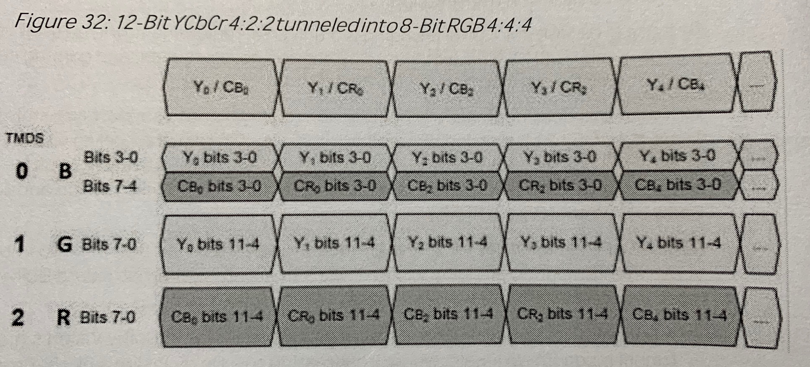

# VSVDB

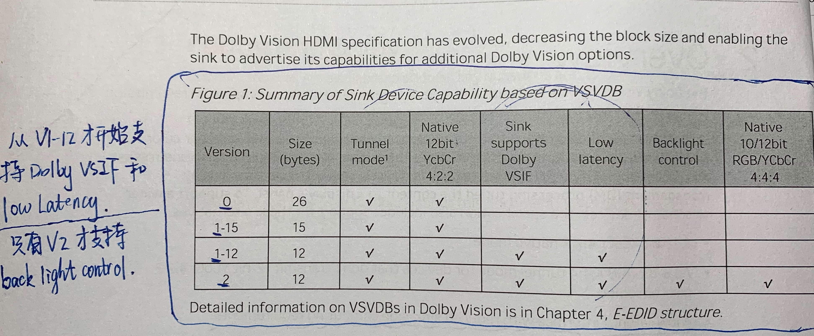

从V1-12开始才支持Dolby VSIF和Low-latency；只有V2才支持back light control

* **Version 0**

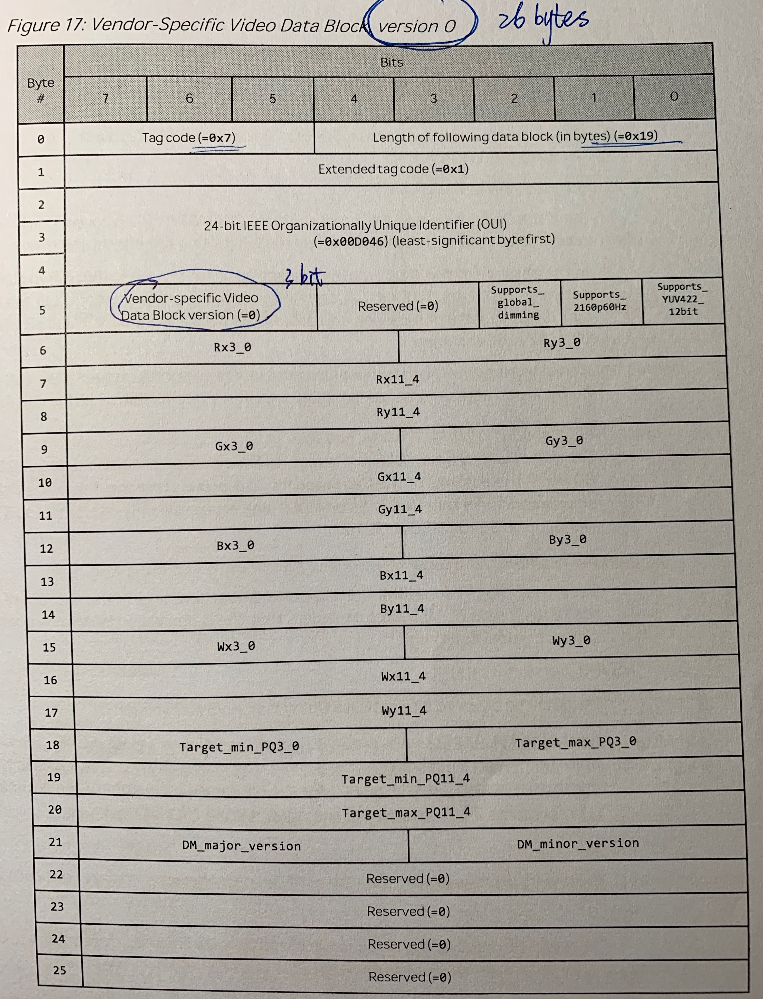

* **Version1-15**

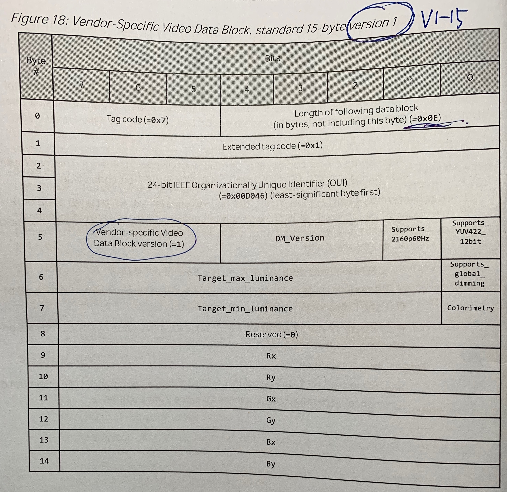

* **Version1-12**

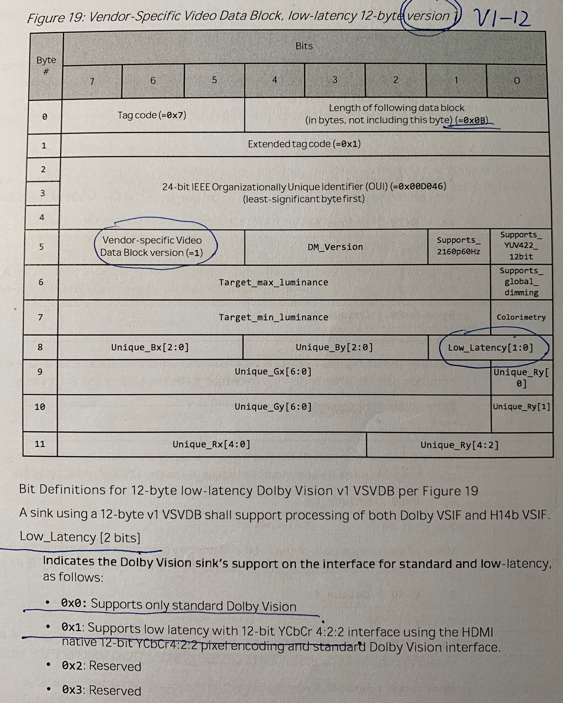

* **Version2**

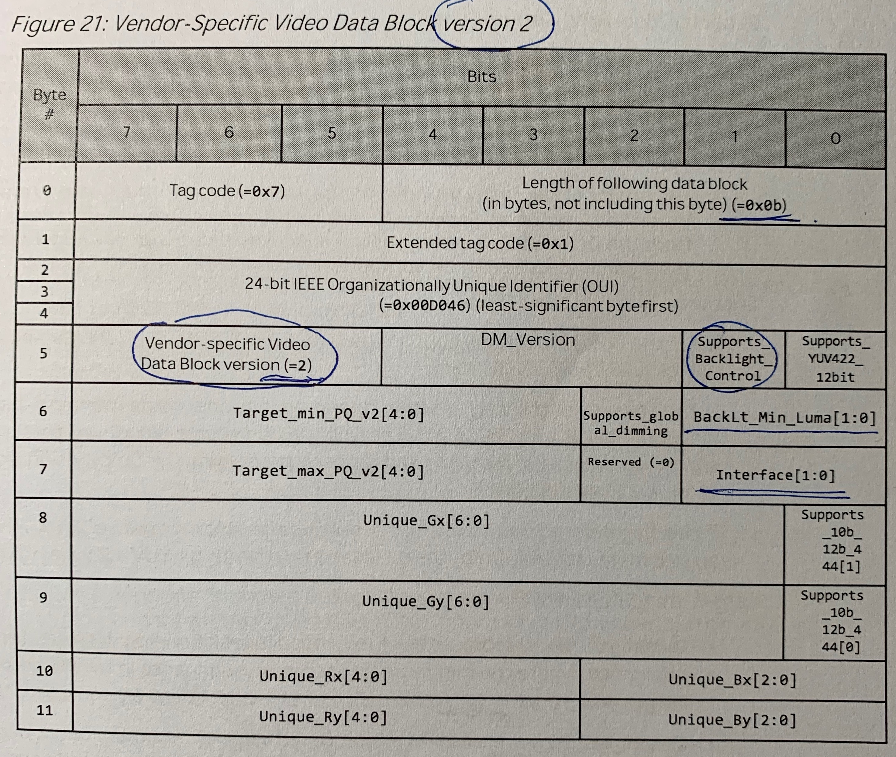

#H14b VSIF & Dolby Vision VSIF

* **H14b VSIF**

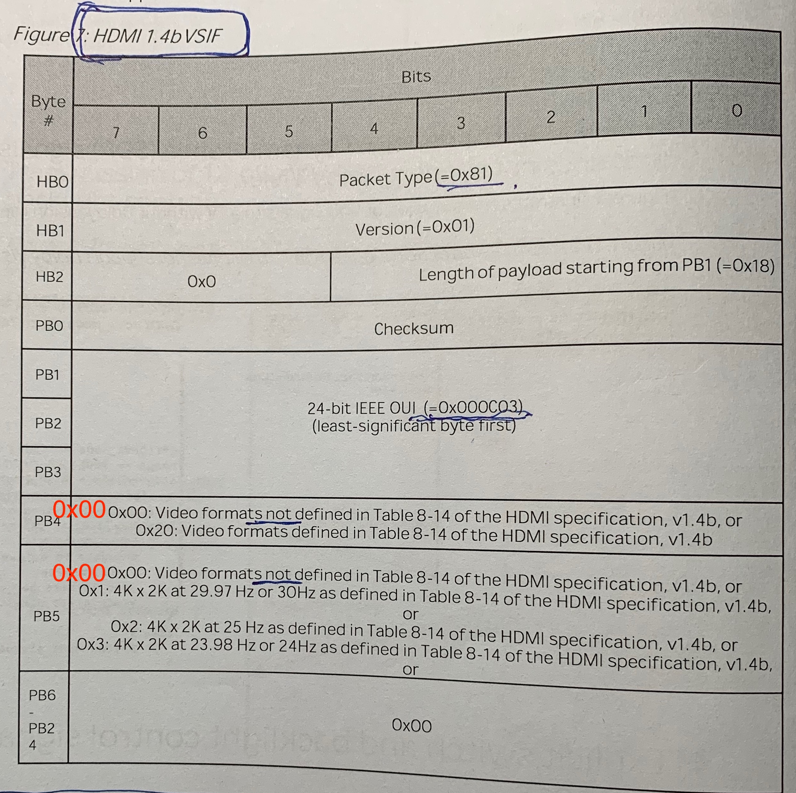

* **Dolby Vision VSIF**

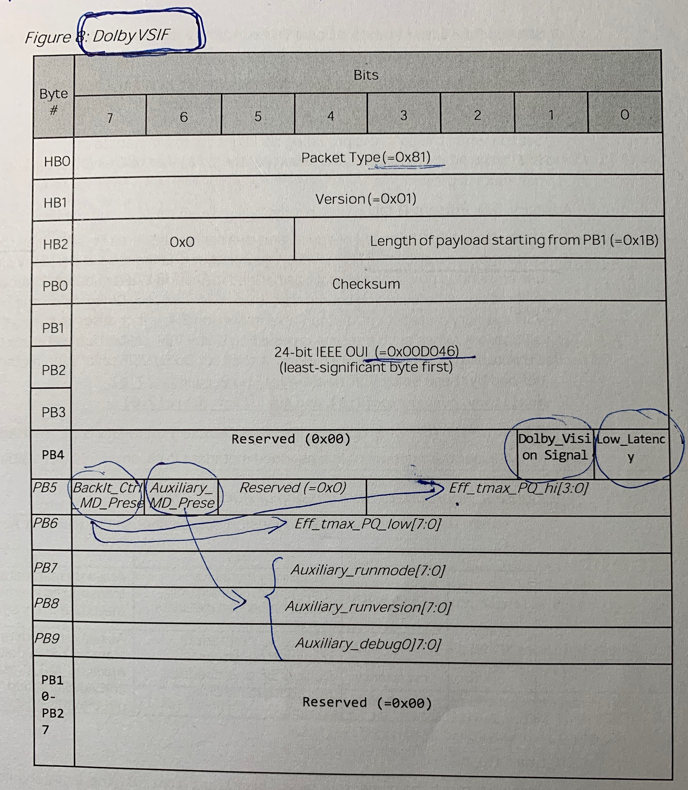

#Standard Dolby Vision Metadata Packetization

1个Standard Dolby Vision Metadata Structure是**128byte（1024bit**）;为了提高metadata传输的稳健性，**每个metadata packet连续传送3次**。

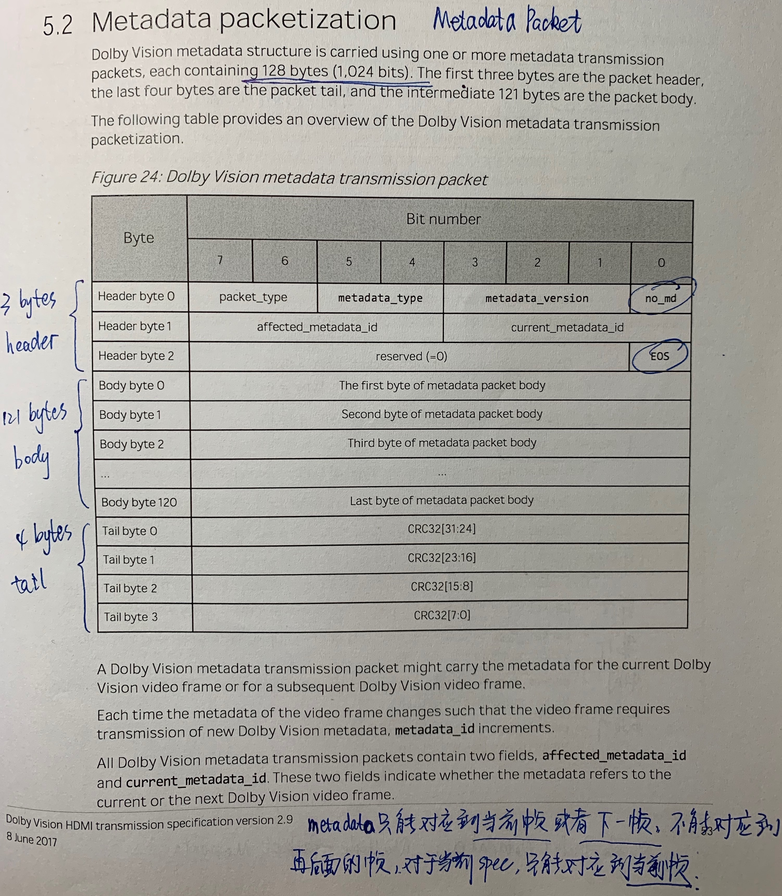

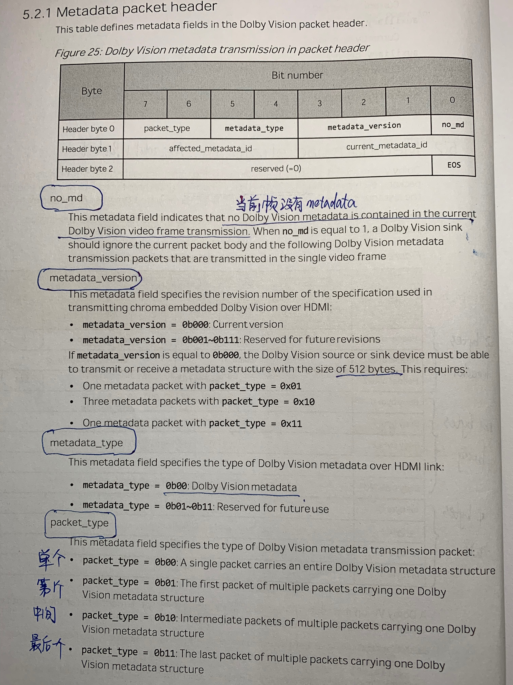

## metadata怎么嵌入到video frame

Metadata被嵌入到active video frame头几行pixel的chroma的LSB bit。对于YCbCr422而言，Cb或Cr的LSB都在channel 0（D0）传送，所以embedded metadata都在channel 0传送。

# Dolby  Vision 无缝切换Timing要求

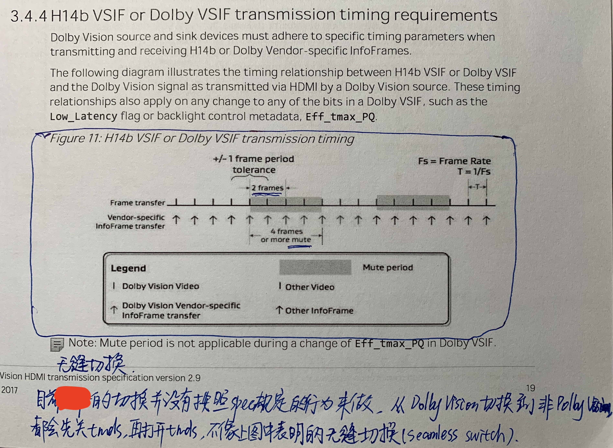

#Dolby Vision Repeater行为

Standard Doblby Vision HDR情况下，如果Repeater要叠OSD，一定不能破环embedded metadata，尤其是active video的前面几行包含了metadata。

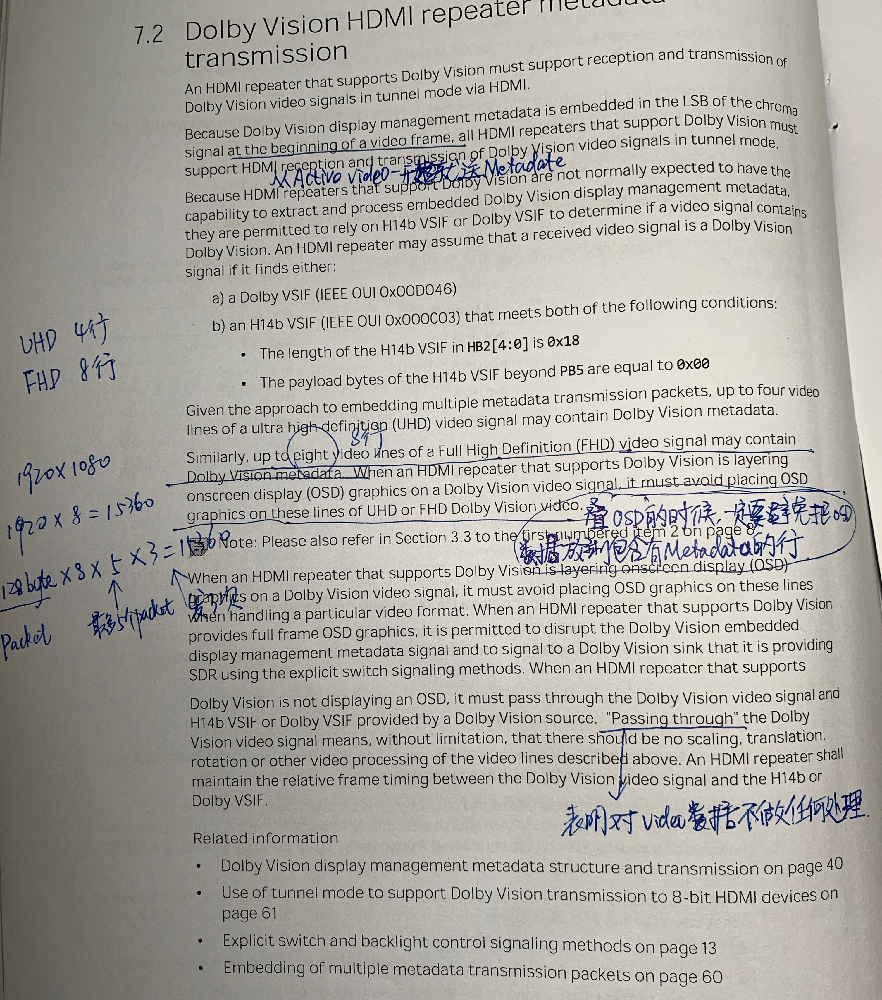