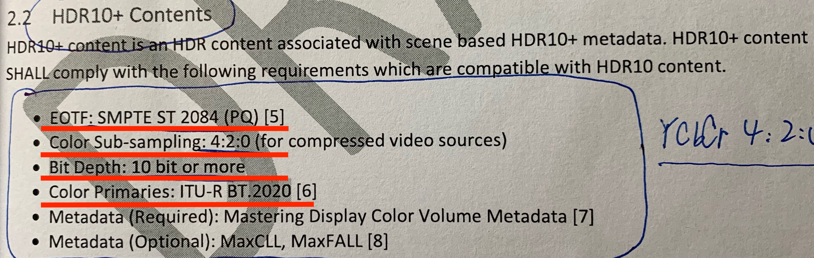
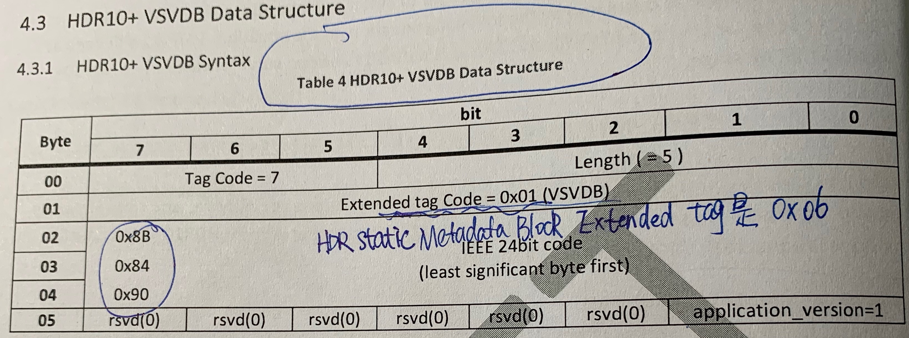
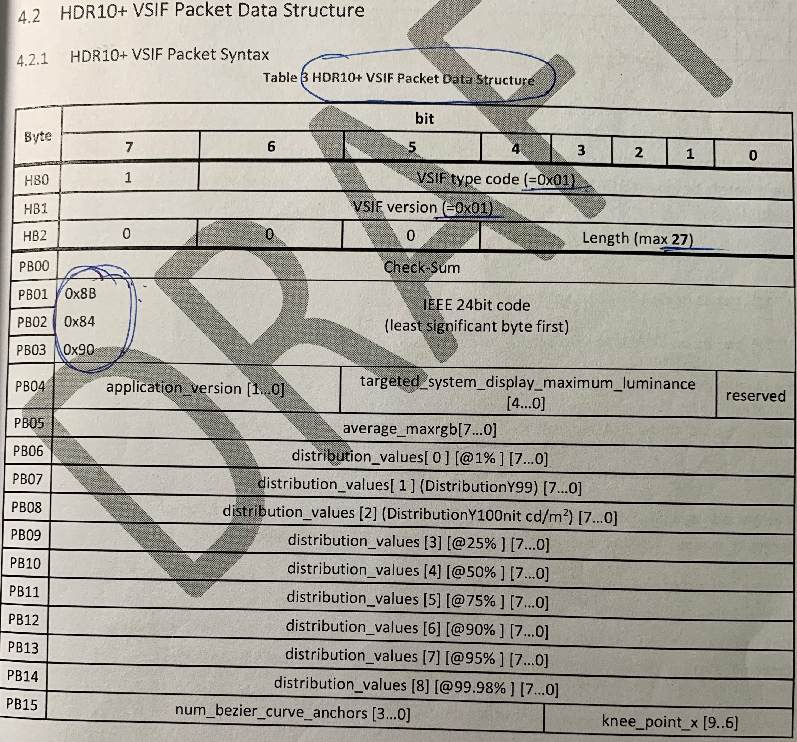
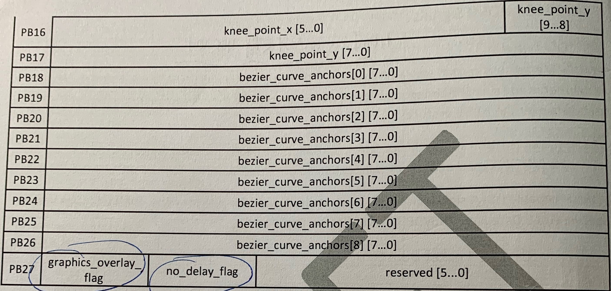
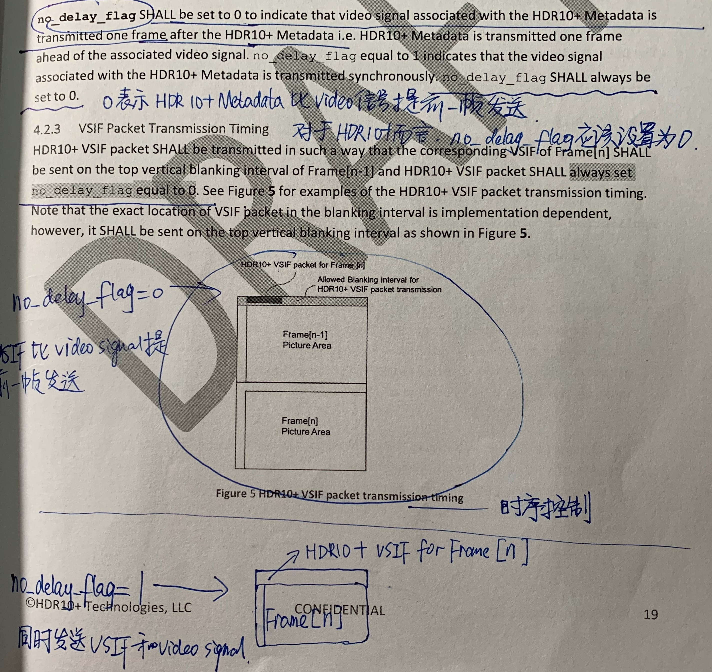

* 三星标准HDR10+ 用HDR 10+ VSIF传送metadata
* HDMI 2.1spec里面定义的HDR10+ 用HDR EMP发送metadata

HDR10+ metadata is carried over HDMI version 2.0 or later. **HDMI 2.0以后的标准才可以传送三星标准的HDR10+ metadata**

#HDR10+ Content

三星标准的HDR10+ 内容必须是：

1. **YCbCr420编码方式**
2. **color depth在10bit以上**
3. **colorimetry是BT2020**
4. **EOTF是SMPTE ST 2084**

而***Dolby Vision的内容是12bit YCbCr422***

#HDR10+ VSVDB Data Structure

HDR10+ VSVDB总共只有6byte，包含的信息极少。对于Tx或Rx而言，此VSVDB只是用于表明能支持HDR10+，所以包含的信息很少没有关系。

# HDR10+ VSIF Packet Data Structure

**graphics_overlay_flag** shall be set to 1 to indicate that video signal associated with the HDR10+ Metadata has graphics overlay. Otherwise, Shall be set to 0.

**no_delay_flag** SHALL be set to 0 to indicate that video signal associated with the HDR10+ Metadata is transmitted one frame after the HDR10+ Metadata i.e. HDR10+ Metadata is transmitted one frame ahead of the associated video signal. no_delay_flag equal to 1 indicates that the video signal associated with the HDR10+ Metadata is transmitted synchronously. 

no_delay_flag =0,表示HDR10+ Metadata比对应video信号提前一帧发送;  no_delay_flag =1,表示metadata和video信号在同一帧发送。

## VSIF Packet Transmission Timing

