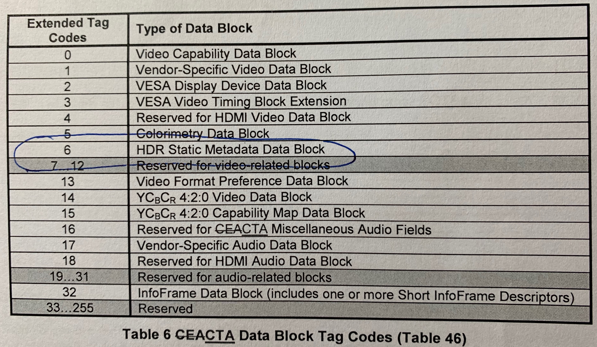
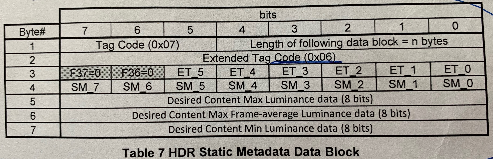
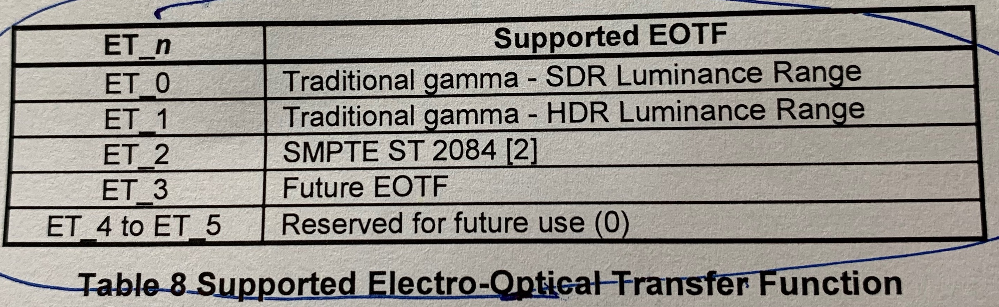
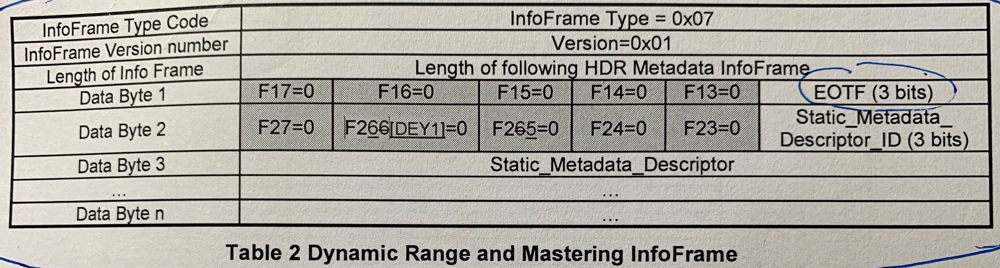
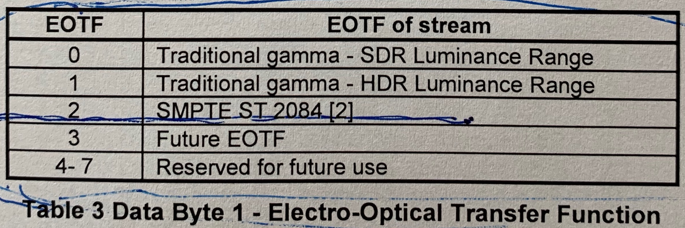
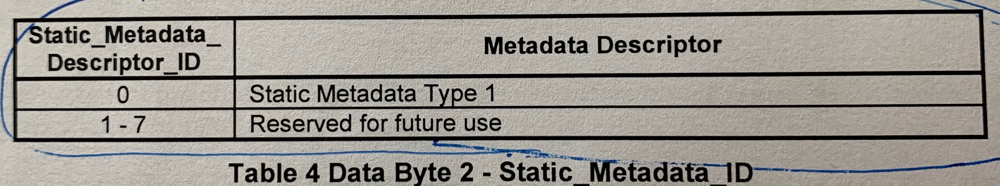
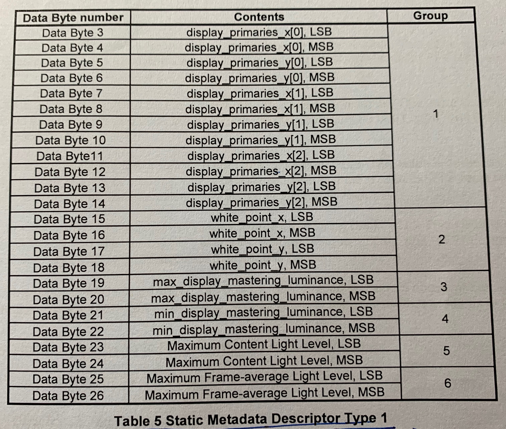

#HDR Static Metadata Data Block

**常用EOTF：ET_2: SMPTE ST 2084 ;    ET_3: HLG**

#Dynamic Range and Mastering InfoFrame

the Source shall send Dynamic Rnage and Mastering InfoFrame once per Video Field while it is sending data associated with dynamic range of the video stream.**每帧发一次**

